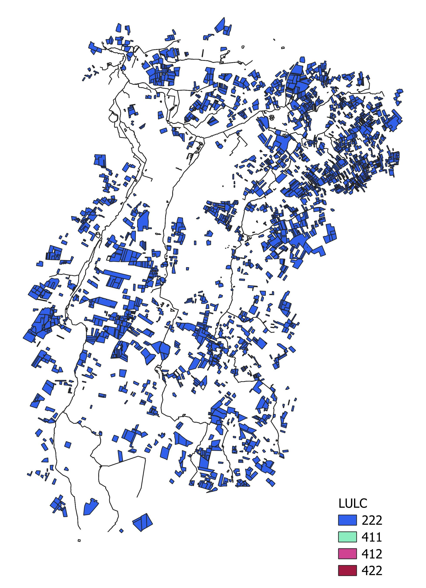
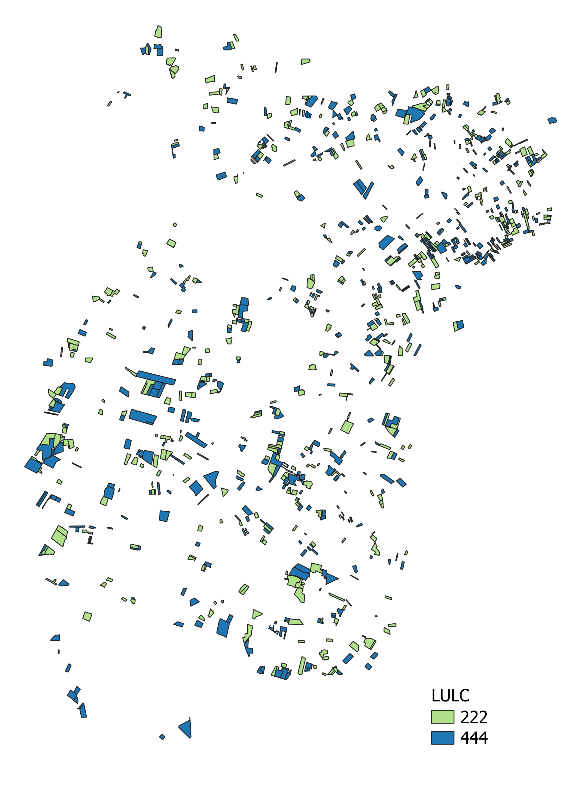

# Scenario creation

xCropProtection is currently packaged with 3 scenarios located in *\xCropProtection\scenario\\*:

- Rummen-full
    - A landscape scenario in Rummen, Belgium.
    ??? info "Image"
        {width="60%"}

- Rummen-xCP-TestingScenario
    - A subset of the Rummen-full scenario in Rummen, Belgium.
    - Contains 1,000 fields with LULC values equally split between 222 and 444.
    ??? info "Image"
        {width="60%"}

- Wetterau-scenario-subset
    - A small scenario which serves as a demonstration and test case for xCropProtection.
    ??? info "Image"
        {width="60%"}

## Custom scenarios

To create a new scenario for use in xCropProtection, users should follow these steps.

1. In *\xCropProtection\scenario\\*, create a new folder with the scenario name. In this example, the scenario will be called "test-scenario".
2. In *\xCropProtection\scenario\test-scenario\\*, create a folder named "geo". Copy a *scenario.xproject* file from a different scenario or create a new file and copy the following text:
``` xml
<?xml version="1.0" encoding="utf-8"?>
<Project 
xmlns="urn:xLandscapeModelScenarioInfo"
xmlns:xsi="http://www.w3.org/2001/XMLSchema-instance"
xsi:schemaLocation="urn:xLandscapeModelScenarioInfo ../../model/core/base/scenario.xsd">
    <Name>SCENARIO NAME</Name>
    <Version>1.0</Version>
    <SupportedRuntimeVersions>
        <Version variant="xKnowRes" number="0.1"/>
    </SupportedRuntimeVersions>
    <Description>DESCRIPTION</Description>
    <TemporalExtent>
        <FromDate>2000-01-01</FromDate>
        <ToDate>2000-12-31</ToDate>
    </TemporalExtent>
    <Changelog>
        <Version number="1.0" date="2000-01-01">
            <Change author="your initials">Scenario created.</Change>
        </Version>
    </Changelog>
    <Content>
        <Item name="LandscapeScenario" target="geo/package.xinfo" version="1" />
    </Content>
    <Contacts>
        <Contact>Thorsten Schad - thorsten.schad@bayer.com</Contact>
    </Contacts>
</Project>
```
Add correct values for all elements in *scenario.xproject*.
3. In the geo folder:
    1. Place the shapefiles of the spatial data to be used in the scenario.
    2. Create *package.xinfo*. Copy from another scenario or use the following text:
    ```xml
    <?xml version="1.0" encoding="utf-8"?>
    <landscape_package 
        xmlns="urn:xCropProtectionLandscapeScenarioGeoPackage" 
        xmlns:xsi="http://www.w3.org/2001/XMLSchema-instance" 
        xsi:schemaLocation="urn:xCropProtectionLandscapeScenarioGeoPackage ../../../model/variant/package.xsd"
    >
    <meta>
        <version>1.0</version>
        <target_type>222</target_type>
        <habitat_types>0</habitat_types>
    </meta>
    <base>
        <base_landscape_geometries>LULC.shp</base_landscape_geometries>
        <feature_id_attribute>ALVID</feature_id_attribute>
        <feature_type_attribute>LULCTypeId</feature_type_attribute>
        <additional_attributes/>
    </base>
    <supplementary>
    </supplementary>
    <supplementary_shapefiles/>
    </landscape_package>
    ```
    `base_landscape_geometries` defines the name of the shapefile contained in the geo folder. `feature_id_attribute` defines the field used to distinguish individual fields/features. It is not recommended to use OBJECTID for this. `feature_type_attribute` defines the field that specifies a feature's LULC type. The TargetCrops value in *PPMCalendar.xml* refers to the field defined in `feature_type_attribute`.
4. In *xCropProtection\CropProtection\\*, create a file named *xCropProtection-test-scenario.xml*. It can be left blank for the moment.
5. In *xCropProtection\CropProtection\PPMCalendars\\*, create a folder with the same name as the new scenario. In that folder, place all *PPMCalendar.xml* files that should be included with the new scenario. Note that not every file in this folder will be used during a run of xCropProtection, file names must first be added to *xCropProtection-test-scenario.xml*. Examples of *PPMCalendar.xml* files can be found in [Templates](scenarios/simple-scenario.md).
6. Modify *xCropProtection\CropProtection\xCropProtection-test-scenario.xml* to include PPMCalendars. Sample:
```xml
<xCropProtection xmlns="urn:xCropProtectionLandscapeScenarioParametrization"
    xmlns:xsi="http://www.w3.org/2001/XMLSchema-instance"
    xsi:schemaLocation="urn:xCropProtectionLandscapeScenarioParametrization ../model/core/components/xCropProtection/xCropProtection.xsd">
    <PPMCalendars>
        <PPMCalendar include="PPMCalendars/test-scenario/PPMCalendar-1.xml"/>
        <PPMCalendar include="PPMCalendars/test-scenario/PPMCalendar-2.xml"/>
    </PPMCalendars>
    <Technologies include="Technologies.xml"/>
</xCropProtection>
```
*Technologies.xml* will exist after cloning xCropProtection. However, if a PPMCalendar contains a Technology not already included in *Technologies.xml*, it must be added to the file in a manner consistent with the elements already present.
7. Make a copy of *template.xrun*; rename the copy with a unique name. Change elements in the file so that xCropProtection uses the new scenario files. Be sure to change:
    - Project: scenario/test-scenario
    - CropProtectionScenario: test-scenario
    - SimID: a string that does not already exist in the run folder
    - SimulationStart and SimulationEnd: set the first and last date to be simulated

After these steps are completed, the new scenario files should have the following structure:

``` { .yaml .no-copy }
├── CropProtection
│   ├── PPMCalendars
│   │   ├── test-scenario
│   │   │   ├── PPMCalendar-2.xml
│   │   │   ├── PPMCalendar-1.xml
│   ├── Technologies.xml
│   └── xCropProtection-test-scenario.xml
├── scenario
│   ├── test-scenario
│   │   ├── geo
│   │   │   ├── (multiple shp files)
│   │   │   └── package.xinfo
│   │   └── scenario.xproject
└── template-test-scenario.xrun
```

Drag *template-test-scenario.xrun* onto *__start_\_.bat* to run xCropProtection using the new scenario.
