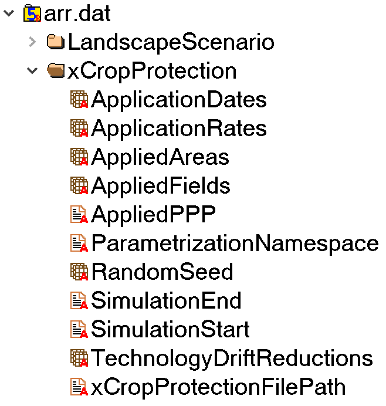

# Welcome to xCropProtection

Welcome to the xCropProtection (xCP) documentation. This documentation will walk new users through how to get started with the xCropProtection Landscape Model component, including explanations for sample input files.

## Intro
xCropProtection is a Landscape Model component for simulating applications of plant protection products on fields within a given landscape. On each day and field in the simulation, the module checks if there are products to apply. If so, exact application dates, rates etc. are sampled from distributions given by the user.

## Installation

### Option 1: only xCropProtection

A user who only needs the functionality of xCP should clone the repository [xCropProtectionDemo](https://github.com/xlandscape/xCropProtectionDemo/tree/main). Contact Sascha Bub ([sascha.bub@rptu.de](mailto:sascha.bub@gmx.de)) for access to the repository. Cloning steps vary based on the application being used:

- [Sourcetree](https://support.atlassian.com/bitbucket-cloud/docs/clone-a-git-repository/)
- [Visual Studio Code](https://learn.microsoft.com/en-us/azure/developer/javascript/how-to/with-visual-studio-code/clone-github-repository?tabs=activity-bar)

After cloning the repository, a user will have everything necessary to start using xCropProtection including sample scenarios and parametrization files.

### Option 2: add xCP to an existing Landscape Model

1. The Landscape Model must first be set up; see the Landscape Model Core's [README](https://github.com/xlandscape/LandscapeModel-Core/blob/master/README.md) for detailed instructions.
2. Create an xCropProtection folder in *\core\components* if it does not already exist.
3. Copy the xCropProtection component from [GitHub](https://github.com/xlandscape/xCropProtectionDemo/tree/main) into the xCropProtection subfolder.
4. The file *mc.xml* contains information about the components that are used during a simulation run. Make use of the xCropProtection component by adding the following lines:

``` xml
<xCropProtection module="components" class="xCropProtection">
    <xCropProtectionFilePath scales="global">
        $(_PROJECT_DIR_)\CropProtection\$(CropProtectionScenario).xml
    </xCropProtectionFilePath>
    <ParametrizationNamespace scales="global">
        urn:xCropProtectionLandscapeScenarioParametrization
    </ParametrizationNamespace>
    <SimulationStart type="date" scales="global">
        $(SimulationStart)
    </SimulationStart>
    <SimulationEnd type="date" scales="global">
        $(SimulationEnd)
    </SimulationEnd>
    <RandomSeed type="int" scales="global">
        0
    </RandomSeed>
    <OutputApplicationType>
        $(OutputApplicationType)
    </OutputApplicationType>
    <ProductDatabase>
        $(_PROJECT_DIR_)\$(ProductDatabase)
    </ProductDatabase>
    <Fields>
        <FromOutput component="LandscapeScenario" output="FeatureIds"/>
    </Fields>
    <LandUseLandCoverTypes>
        <FromOutput component="LandscapeScenario" output="FeatureTypeIds"/>
    </LandUseLandCoverTypes>
    <FieldGeometries>
        <FromOutput component="LandscapeScenario" output="Geometries"/>
    </FieldGeometries>
</xCropProtection>
```

## Getting started

Below is an example of the folder structure of xCropProtection after being cloned:

``` { .yaml .no-copy }
├── CropProtection
│   ├── PPMCalendars
│   │   ├── Rummen-full
│   │   │   ├── PPMCalendar-1a-L1.xml
│   │   │   ├── PPMCalendar-1a-L2.xml
│   │   │   ├── PPMCalendar-1b-L1.xml
│   │   │   └── PPMCalendar-1b-L2.xml
│   │   ├── Rummen-xCP-TestingScenario
│   │   │   ├── PPMCalendar-222.xml
│   │   │   └── PPMCalendar-444.xml
│   │   └── ...
│   ├── Technologies.xml
│   ├── xCropProtection-rummen-full.xml
│   ├── xCropProtection-rummen-xCP-testing.xml
│   └── ...
├── analysis
│   ├── ProductNames.csv
│   ├── ProductTypes.csv
│   ├── requirements.txt
│   ├── xCP_map_vis.ipynb
│   ├── xCP_plots.ipynb
│   ├── xCP_total_loading.ipynb
│   └── xCP_write_csv.ipynb
├── model
│   ├── core
│   ├── variant
│   │   ├── experiment.xml
│   │   ├── mc.xml
│   │   └── package.xsd
├── scenario
│   ├── Rummen-full
│   │   ├── Documentation
│   │   │   ├── scenario-geo-image.jpg
│   │   │   └── scenario-project.qgz
│   │   ├── geo
│   │   │   ├── (multiple shp files)
│   │   │   └── package.xinfo
│   │   ├── weather
│   │   │   └── weather_mars-97100.csv
│   │   └── scenario.xproject
│   ├── Rummen-xCP-TestingScenario
│   │   ├── Documentation
│   │   │   ├── scenario-geo-image.jpg
│   │   │   └── scenario-project.qgz
│   │   ├── geo
│   │   │   ├── (multiple shp files)
│   │   │   └── package.xinfo
│   │   └── scenario.xproject
│   └── ...
├── .gitignore
├── .gitmodules
├── README.md
├── __start__.bat
└── template.xrun
```

To start xCropProtection using the sample scenario, drag *template.xrun* onto *__start_\_.bat*. This will start an xCropProtection run using Rummen-xCP-TestingScenario as input. Output of the model run can be found in the newly created *\run\Rummen-xCP-TestingScenario\mcs\\[mc run ID]\store\arr.dat*.

!!! note
    xCropProtection will create a folder for each run using the SimID defined in *template.xrun*. The SimID cannot be the same as a folder already contained in the run folder. Delete this folder to make multiple xCropProtection runs with the same SimID.

## Viewing and analyzing the output

To view the unprocessed output of xCropProtection, open *\run\Rummen-xCP-TestingScenario\mcs\\[mc run ID]\store\arr.dat* with a HDF5 file viewer such as [HDFView](https://hdfgroup.org/downloads/hdfview/). Expand the xCropProtection folder.



Right click on an item and click "Open" to view its attributes and data.

!!! warning
    Opening "AppliedAreas" generated from a large amount of input data using HDFView may cause the program to crash due to its data type. Use *xCP_write_csv.ipynb* to write the data to a csv.

The *analysis* folder contains Jupyter notebooks which can analyze and visualize the output of xCropProtection. *requirements.txt* lists python packages necessary to run the Jupyter notebooks in this folder.

### *xCP_write_csv.ipynb*

Version 1.0

Writes the contents of *arr.dat* to a csv file. User parameters:

`xcrop_arrdat_path` : *C:\path\to\arr.dat*

`app_rates_path` : *C:\path\to\output_file.csv*

In the last cell, comment or uncomment any of the following lines to change the columns written to the csv.

``` py
dfs.append(pandas.DataFrame(application_dates, columns=["ApplicationDates"]))
dfs.append(pandas.DataFrame(application_dates_day_month, columns=["ApplicationDayMonth"]))
dfs.append(pandas.DataFrame(applied_features_data, columns=["FeatureID"]))
dfs.append(pandas.DataFrame(application_rates_data, columns=["ApplicationRates(g/ha)"]))
dfs.append(pandas.DataFrame(decode_PPP, columns=["AppliedPPP"]))
dfs.append(pandas.DataFrame(geom_project_area_ha, columns=["AppliedArea(ha)"]))
dfs.append(pandas.DataFrame(application_rates_data * geom_project_area_ha, columns=["AppliedMass(g)"]))
dfs.append(pandas.DataFrame(drift_reduction_data, columns=["TechnologyDriftReductions"]))
```

### *xCP_plots.ipynb*

Version 1.0

Plots application rates (as a scatter plot) of all product applications in a user-defined year. User parameters:

`xcrop_arrdat_path` : *C:\path\to\arr.dat*

`year_to_chart` : only display data for this year

### *xCP_total_loading.ipynb*

Version 1.0

Charts the total loading over time for a specific field. Total loading is calculated by plotting a cumulative sum of mass applied to a field. User parameters:

`xcrop_arrdat_path` : *C:\path\to\arr.dat*

`total_loading_path` : *C:\path\to\output_file.csv*

`input_LULC_path` : *C:...\xCropProtection\scenario\scenario_name\geo\input_spatial_data.shp*

`feature_to_chart` : ID of the field to chart. If a field ID is invalid, the notebook will plot the total loading of the first field it reads.

### *xCP_map_vis.ipynb*

Version 1.0

Visualizes applications on a map with the ability to advance through time. Currently, this is only built and tested for runs using the *Rummen-xCP-TestingScenario*. Users should be aware that the map visualization will need code modification and additional input to work with other scenarios. User parameters:

`data_store_path` : *C:\path\to\arr.dat*

`output_map_html_path` : *C:path\to\output\html_map.html*

`output_map_html_2_path` : *C:\path\to\output\html_map_2.html*

`product_table` : *C:...\xCropProtection\analysis\ProductTypes.csv*. This table defines product names and their type.

`product_colors` : *C:..\xCropProtection\analysis\ProductNames.csv*. This file defines product names and the color they will be symbolized with.