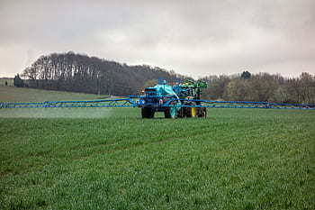

# Glossary
Basically, all xCP entities are defined close to the real-world objects they represent.  
(September 2024: status=work in progress; 'xxx' mark locations to be done)

## Application
When a PPP is (or PPPs are) applied to a certain crop at a certain field we call this an *Application*. Typically, a farmer puts a PPP (or a set of PPPs) into a spraying tank, fills the tank up with water, drives to the field and sprays the solution onto the field (into the crop). Here, the term *Application* and is related to its operation use in pesticide risk assessment, especially the exposure modelling part.  
 Thus, an application is defined by  
 - the PPP (or PPPs) to be applied,  
 - an application rate (eg, in µg a.s./ha or mL/ha)  
 - a time when the application is intended (eg, deterministic day or a time window with a related distribution function)  
 - the technology with which the application will be done (eg, boom sprayer)  
 - risk mitigation measures (eg, spray buffer, drift-reducing nozzles)  
  

  
*PPP spray application using a boom sprayer*  

Remark: Influenced by classic exposure modelling, at the current development status, the definition of an *Application* includes the definition of an application timing, although in reality typically the use of a PPP is related to crop development stages. Thus, currently, the modeller has to determine the dependence of regional crop development with time. Future xCP versions are planned to allow defining an *Application* related to crop development stage (which can bw provided by databases or crop development modelling). 

## Application Rate
In usual agricultural practice, the amount of PPPs applied to a field is determined as amount PPP by field area. 
The farmer typically determines the volume PPP [mL] by field area [ha] (eg, considering the crop development status in preparation).   
Modelling practice for risk assessment purposes often focuses on active substance (a.s.). Therefore, the *Application Rate* can be defined as [µg a.s./ha] or as product [mL/ha].

## Application Sequence (draft)
A sequence of individual PPP *Applications*. Basically, each individual *Application* within an *Application Sequence* can be defined independently. Thus, an *Application Sequence* can represent the multiple use of the same PPP (PPPs), using the same technology and risk mitigation, yet at individual application rates (eg, as often the case for fungicide uses in orchards). However, an *Application Sequence* can also represent uses of different PPPs in a sequence.   

*Illustration of a PPP application sequence using different PPPs  
(https://rwz.ag/fileadmin2023/Agrarhandel/Weinbau/Mosel/240124_bild_weinbauempfehlung-pflanzenschutz-mosel.png)*

## Application Window
 The time when an application is intended. In a modelling experiment using xCP an individual *Application Window* can be a deterministic day or a time span (eg, 1.-14. April). A probability distribution function is assigned to an application window from which actual application dates are sampled during model runtime. 

Remark: Influenced by classic exposure modelling, at the current development status, the definition of an *Application* includes the definition of an application timing, although in reality typically the use of a PPP is related to crop development stages. Thus, currently, the modeller has to determine the dependence of regional crop development with time. Future xCP versions are planned to allow defining an *Application* related to crop development stage (which can bw provided by databases or crop development modelling).  
Also, typically farmers' decisions depend on agricultural and environmental conditions. xCP is planned to allow the definition of such dependency rules, eg, not to conduct a certain spray application when a rainstorm is predicted by weather forecast.  

## Buffer
aquatic, terrestric, in-crop buffer xxx

## Ecotox Endpoints

## Experiment
xxx 
A set of *Monte Carlo Runs*.  
baseline (typically zero exposure, yet can be a alternative pest control measures, eg 'organic')

## In-crop

## In-crop Buffer

## Indication
Generally, measures to protect plants (crop) from a certain pest.  
In xCP, an *Indication* is an explicit part of its parameterisation. An *Indication* is made of *PPP Application Sequences*, at minimum one *PPP Application Sequence*. If more than one *Application Sequence* is defined in an *Indication*, these sequences are considered **alternative** *Application sequences*.  
((or?! xxx If more than one *Application Sequence* is defined in an *Indication*, these sequences can be considered **facultative** or as **alternative** *Application sequences*))
Thus, the xCP parameterisation entity *Indication* can be used to define alternative PPP use pattern, eg, reflecting product market shares or fractions 'biological' or 'organic' pest control means.  
Multiple *Indications* can be defined in an xCP parameterisation, as many as necessary to represent a (simple or complex) real-world PPP use pattern in one or many crops. Each individual *Indication* defined will be realised in an xCP simulation. 

  
*xCP entities and their relationship xxx to be replaced by final img*

## Monte Carlo Run

## Off-crop

## Plant Protection Calender
  
can be defined for an entire modelling simulation (experiment)  
  
*Example Plant Protection Recommendation in Apple*

## Plant Protection Measure (PPM)
An action to prevent or control pests, eg, protecting apples against powdery mildew fungy or protecting olives against the white fly.  
In xCP, a *Plant Protection Measure* is represented defining an *Indication*.  

## Plant Protection Product (PPP)
Plant protection products (PPPs) are chemical or biological products which are used to protect plants or plant products from harm caused by animals (insects and rodents, for example) or diseases such as fungal infestation. Products which are used to eliminate unwanted field weeds are also in the group of plant protection products. The term “pesticides” is often used instead of plant protection product.  
PPPs contain one or more active substances and other co-formulants (substances which are supposed to have a positive effect on the production, storage or use of a product). The product itself is used in various forms, for example as spraying agents for seed treatment or in granular form.  

## Risk Mitigation

ref:  
[MAgPie](https://www.openagrar.de/receive/openagrar_mods_00027102)

## Simulation

## Spray-drift Reduction