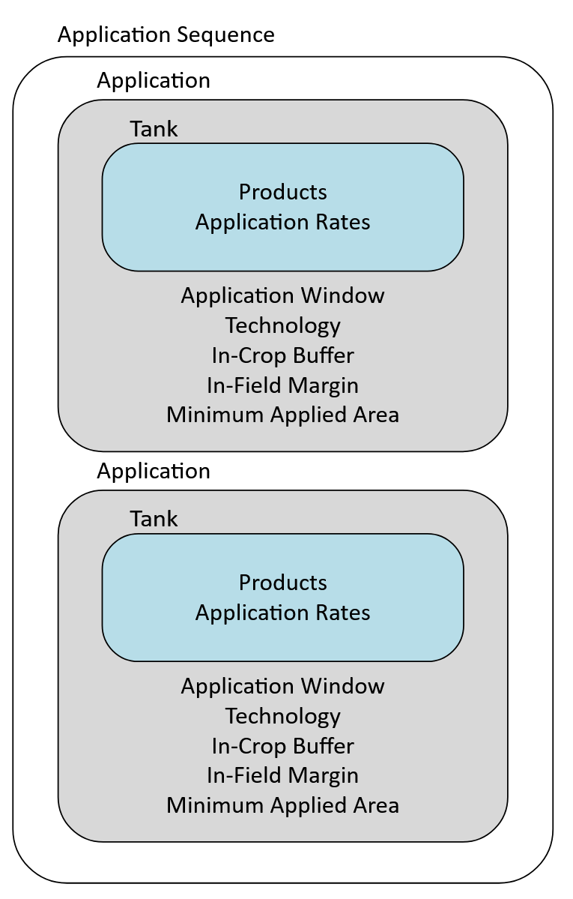

# PPM calendar documentation and technical details

This file contains technical details about PPM Calendar elements. Examples of PPM Calendar files and explanations are located in the [Templates](../scenarios/simple-scenario.md).

!!! note
    '|' symbols are used to separate options in a list.

The general structure of a PPM calendar is

``` xml
<PPMCalendar>
    <TemporalValidity/>
    <TargetCrops/>
    <Indications>
        <Indication>
            <ApplicationSequence>
                <Application>
                    <Tank>
                        <Products/>
                        <ApplicationRates>
                            <ApplicationRate/>
                        </ApplicationRates>
                    </Tank>
                    <ApplicationWindow/>
                    <Technology/>
                    <InCropBuffer/>
                    <InFieldMargin/>
                    <MinimumAppliedArea/>
                </Application>
            </ApplicationSequence>
        </Indication>
    </Indications>
</PPMCalendar>
```
  

## Application

**Type**: N/A

**Unit**: N/A

**Scales**: N/A

**Notes**:

- Each `Application` in an `ApplicationSequence` will be applied to the same field.
</ul>

``` xml
<Application>
    ...
</Application>
```

## Temporal Validity

**Type**: none, xCropProtection.MonthDaySpan, or xCropProtection.DateSpan

**Unit**: N/A

**Scales**: time/simulation|time/day|time/year

**Notes**:

- Format: 'mm-dd to mm-dd' or 'yyyy-mm-dd to yyyy-mm-dd'.
- Set 'always' if the PPM Calendar should be applied over the whole simulation.

Apply calendar over the whole simulation:

    <TemporalValidity scales="time/simulation"> always </TemporalValidity>

Apply calendar over specific months each year:

    <TemporalValidity type="xCropProtection.MonthDaySpan">
        01-01 to 06-30
    </TemporalValidity>

Apply calendar only on specific years:

    <TemporalValidity type="xCropProtection.DateSpan">
        2001-01-01 to 2001-12-31
    </TemporalValidity>

## Target Crops

**Type**: int or list[int]

**Unit**: N/A

**Scales**: global|time/day|time/year

**Notes**:

- This is an optional element. It should only be included in a *PPMCalendar.xml* if applications must be restricted to specific crop types.
- Separate target crops with a space.
</ul>

Apply PPM calendar to fields with crop type 9:

    <TargetCrops type="list[int]" scales="global">
        9
    </TargetCrops>

Apply PPM calendar to fields with crop type 9 or 16:

    <TargetCrops type="list[int]" scales="global">
        9 16
    </TargetCrops>

## Target Fields

**Type**: int or list[int]

**Unit**: N/A

**Scales**: global|time/day|time/year

**Notes**:

- This is an optional element. It should only be included in a *PPMCalendar.xml* if applications must be restricted to specific fields.
- Separate target fields with a space.
- The name of the identifier which uniquely identifies each field can be changed in *package.xinfo* located in a scenario's geo folder.
</ul>

Only apply PPM Calendar to field 100:

    <TargetFields type="list[int]" scales="global">
        100
    </TargetFields>

Only apply PPM Calendar to fields 30 and 31:

    <TargetFields type="list[int]" scales="global">
        30 31
    </TargetFields>

## Indications

**Type**: N/A or xCropProtection.ChoiceDistribution

**Unit**: N/A

**Scales**: time/year, space/base_geometry

**Notes**:

- If the type of this element is left blank, xCP will sample all `Indications`. If the type of this element is "xCropProtection.ChoiceDistribution", xCP will sample one `Indication` based on specified probability values. See [Multiple Indications](../scenarios/multiple-indications.md) and [Multiple Indications with Choice](../scenarios/multiple-indications-with-choice.md) for examples.
</ul>

Sample all `Indications`:

    <Indications>
        <Indication>
            ...
        </Indication>
        <Indication>
            ...
        </Indication>
    <Indications>

Sample 1 `Indication` based on probability values:

    <Indications type="xCropProtection.ChoiceDistribution" scales="time/year, space/base_geometry">
        <Indication probability="0.6">
            ...
        </Indication>
        <Indication probability="0.4">
            ...
        </Indication>
    <Indications>

## Indication

**Type**: xCropProtection.ChoiceDistribution

**Unit**: N/A

**Scales**: time/year, space/base_geometry

Choose 1 `ApplicationSequence` based on probability values:

    <Indication type="xCropProtection.ChoiceDistribution" scales="time/year, space/base_geometry">
        <ApplicationSequence probability="0.5">
            ...
        </ApplicationSequence>
        <ApplicationSequence probability="0.5">
            ...
        </ApplicationSequence>
    </Indication>

## Application Sequence

**Type**: N/A

**Unit**: N/A

**Scales**: N/A

**Notes**:

- `ApplicationSequence` probabilities must sum to exactly 1.0 for each `Indication`.
</ul>



Example of 1 `ApplicationSequence`:

    <ApplicationSequence probability="1">
        ...
    </ApplicationSequence>

Example of 2 `ApplicationSequence` elements:

    <ApplicationSequence probability="0.5">
        ...
    </ApplicationSequence>
    <ApplicationSequence probability="0.5">
        ...
    </ApplicationSequence>


## Tank

**Type**: N/A

**Unit**: N/A

**Scales**: N/A

**Notes**:

- If a tank mixture is being implemented (more than 1 product in the `Tank`), the number of products in the `Tank` must be the same as the number of `ApplicationRates` defined.
</ul>

A `Tank` containing 1 product:

    <Tank>
        <Products type="list[str]" scales="other/products">
            Product 1
        </Products>
        <ApplicationRates scales="other/products">
            <ApplicationRate type="float" unit="g/ha" scales="global">
                100
            </ApplicationRate>
        </ApplicationRates>
    </Tank>

A `Tank` containing a tank mix with 2 products:

    <Tank>
        <Products type="list[str]" scales="other/products">
            Product 1|Product 2
        </Products>
        <ApplicationRates scales="other/products">
            <ApplicationRate type="float" unit="g/ha" scales="global">
                100
            </ApplicationRate>
            <ApplicationRate type="float" unit="g/ha" scales="global">
                70
            </ApplicationRate>
        </ApplicationRates>
    </Tank>

## Products

**Type**: list[str] (list of strings)

**Unit**: N/A

**Scales**: other/products

**Notes**:

- Multiple products in the `Products` element must be separated with a | symbol. Products may have spaces in their names.
- The name defined in this element is what will be assigned to fields as they receive applications.
</ul>

``` xml
<Products type="list[str]" scales="other/products">
    Example Product
</Products>
```

## Application Rates

**Type**: float, xCropProtection.NormalDistribution, or xCropProtection.UniformDistribution

**Unit**: g/ha

**Scales**: global|time/day|time/year|time/day, space/base_geometry|time/year, space/base_geometry

Constant `ApplicationRate`:

    <ApplicationRate type="float" unit="g/ha" scales="global">300</ApplicationRate>

`ApplicationRate` with uniform distribution:

    <ApplicationRate type="xCropProtection.UniformDistribution" unit="g/ha" scales="time/year, space/base_geometry">
        <Lower type="float" scales="global">100</Lower>
        <Upper type="float" scales="global">150</Upper> 
    </ApplicationRate>

`ApplicationRate` with normal distribution:

    <ApplicationRate type="xCropProtection.NormalDistribution" unit="g/ha" scales="time/year, space/base_geometry">
        <Mean type="float" scales="global">50.0</Mean>
        <SD type="float" scales="global">4.0</SD> 
    </ApplicationRate>

## Application Window

**Type**: xCropProtection.MonthDaySpan

**Unit**: N/A

**Scales**: global

**Notes:**

- Format is Month-Day.
- Input must be in format "Month-Day to Month-Day".
</ul>

``` xml
<ApplicationWindow type="xCropProtection.MonthDaySpan" scales="global">
    05-05 to 05-16
</ApplicationWindow>
```

## Technology

**Type**: string

**Unit**: N/A

**Scales**: global

**Notes:**

- This value must match a `Technology` element in *Technologies.xml*.
</ul>

``` xml
<Technology scales="global">Low-drift nozzle</Technology>
```

## In Crop Buffer

**Type**: float, xCropProtection.NormalDistribution, or xCropProtection.UniformDistribution

**Unit**: m (meter)

**Scales**: 

- Constant: global
- Normal/Uniform distribution: time/year, space/base_geometry|time/day, space/base_geometry

**Notes**:

- A value less than 0 will not increase field size.
- The values of `InCropBuffer` and `InFieldMargin` are cumulative.
</ul>

Constant `InCropBuffer`:

    <InCropBuffer type="float" unit="m" scales="global">0</InCropBuffer>

`InCropBuffer` with a uniform distribution:

    <InCropBuffer type="xCropProtection.UniformDistribution" unit="m" scales="time/year, space/base_geometry">
        <Lower type="float" scales="global">5</Lower>
        <Upper type="float" scales="global">10</Upper> 
    </InCropBuffer>

`InCropBuffer` with a normal distribution:

    <InCropBuffer type="xCropProtection.NormalDistribution" unit="m" scales="time/year, space/base_geometry">
        <Mean type="float" scales="global">5</Mean>
        <SD type="float" scales="global">1</SD> 
    </InCropBuffer>

## In Field Margin

**Type**: float, xCropProtection.NormalDistribution, or xCropProtection.UniformDistribution

**Unit**: m (meter)

**Scales**:

- Constant: global
- Normal/Uniform distribution: time/year, space/base_geometry|time/day, space/base_geometry

**Notes**:

- A value less than 0 will not increase field size.
- The values of `InCropBuffer` and `InFieldMargin` are cumulative.
</ul>

Constant `InFieldMargin`:

    <InFieldMargin type="float" unit="m" scales="global">0</InFieldMargin>

`InFieldMargin` with a uniform distribution:

    <InFieldMargin type="xCropProtection.UniformDistribution" unit="m" scales="time/year, space/base_geometry">
        <Lower type="float" scales="global">5</Lower>
        <Upper type="float" scales="global">10</Upper> 
    </InFieldMargin>

`InFieldMargin` with a normal distribution:

    <InFieldMargin type="xCropProtection.NormalDistribution" unit="m" scales="time/year, space/base_geometry">
        <Mean type="float" scales="global">5</Mean>
        <SD type="float" scales="global">1</SD> 
    </InFieldMargin>


## Minimum Applied Area

**Type**: float, xCropProtection.NormalDistribution, or xCropProtection.UniformDistribution

**Unit**: m² (meter²)

**Scales**:

- Constant: global
- Normal/Uniform distribution: time/year, space/base_geometry|time/day, space/base_geometry

**Notes**:

- If a field's area is smaller than this value after applying the `InCropBuffer` and `InFieldMargin` values, no application will occur.
</ul>

Constant `MinimumAppliedArea`:

    <MinimumAppliedArea type="float" unit="m²" scales="global">0</MinimumAppliedArea>

`MinimumAppliedArea` with a uniform distribution:

    <MinimumAppliedArea type="xCropProtection.UniformDistribution" unit="m²" scales="time/year, space/base_geometry">
        <Lower type="float" scales="global">100</Lower>
        <Upper type="float" scales="global">150</Upper> 
    </MinimumAppliedArea>

`MinimumAppliedArea` with a normal distribution:

    <MinimumAppliedArea type="xCropProtection.NormalDistribution" unit="m²" scales="time/year, space/base_geometry">
        <Mean type="float" scales="global">100</Mean>
        <SD type="float" scales="global">5</SD> 
    </MinimumAppliedArea>
