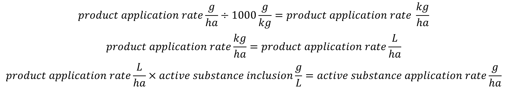

xCropProtection can be parameterized with input of scale product or active substance. Running xCropProtection with active substances is almost identical to using products, though the input scale must be defined in some areas.

## Parameterizing xCropProtection

### XRUN file

In the *xCropProtection* folder, there are one or more XRUN files which define xCropProtection parameters. 2 of the elements in these files are relevant to active substances. The `ProductDatabase` element defines the location of the product/active substance relationship database relative to *__start_\__.bat*. The database should be located in the *xCropProtection/CropProtection* folder.

```{ .xml .no-copy }
<!--
  Parameter		: ProductDatabase
  Description	: The database which contains information on product-active substance relationships.
  Values		: Should be an existing SQLite database (relative path),
                    typically provided in the folder 'CropProtection'
  Remark		: Make sure the database is present in the CropProtection sub-folder.
					Use CropProtection/product-active-substance.db as a default value.
  -->
  <ProductDatabase>CropProtection/product-active-substance.db</ProductDatabase>
```

The `OutputApplicationType` element defines what the output PPP type of xCropProtection should be: product or active substance. The input PPP type is defined in individual PPMCalendars and can vary from application to application. If the output type is active substance, the input type for each application can either be product or active substance. However, if the output type is product, the input type may only be product.

- If the input and output of xCropProtection are the same (product to product or active substance to active substance), xCropProtection will not query the product database. The names of the input will be the same as the names of the output.
- If the input of xCropProtection is product and the output is active substance, xCropProtection will query the database to determine what active substances are included in the input products.
- An input of active substance and output of product is invalid, as it is impossible to determine what product an active substance is part of.

``` { .xml .no-copy }
<!--
Parameter	: OutputApplicationType
Description	: The output type of applications for all fields.
Values		: Should be one of two strings: 'product' or 'active substance' (without '')
Remark		: Note the different combinations of input(specified in PPM Calendars) and output types.
                input product 			-> output product 			: valid
                input product 			-> output product			: valid
                input active substance 	-> output active substance	: valid
                input active substance 	-> output product 			: invalid
-->
<OutputApplicationType>product</OutputApplicationType>
```

### PPM calendars

Input PPP type is specified in the `Products` and `ApplicationRates` elements which may have a scale of "other/products" or "other/active_substances". Within an `Application` element, the scale of these elements must be the same but they may differ for `Application` elements within the same PPM Calendar.

Example of a tank with scale="other/products":

``` xml
<Tank>
    <Products type="list[str]" scales="other/products">
        Product 1
    </Products>
    <ApplicationRates scales="other/products">
        <ApplicationRate type="xCropProtection.NormalDistribution" unit="g/ha" scales="time/year, space/base_geometry">
            <Mean type="float" scales="global">25</Mean>
            <SD type="float" scales="global">1.5</SD> 
        </ApplicationRate>
    </ApplicationRates>
</Tank>
```

Example of a tank with scale="other/active_substances":

``` xml
<Tank>
    <Products type="list[str]" scales="other/active_substances">
        Active substance 1
    </Products>
    <ApplicationRates scales="other/active_substances">
        <ApplicationRate type="float" unit="g/ha" scales="global"> 10 </ApplicationRate>
    </ApplicationRates>
</Tank>
```

## The product/active substance database

xCropProtection contains a SQLite database with relationships between products and active substances. This database is intended to be used as a general database, with products and substances being added as further scenario development occurs.

<figure>
  
  <figcaption>Diagram of the product/active substance database.</figcaption>
</figure>

To add a new formulation, make sure that the product and active substance(s) required already exist in the database. If they do not, add them to their respective tables, making sure to fill out all columns. Then, create a new row in the formulations table with the ID of the new product and active substance. If a product has more than one active substance, create 2 rows with the same Product_ID value and different ActiveSubstance_ID values:

| Product_ID | ActiveSubstance_ID | InclusionLevel_g_per_L | Source        |
|------------|--------------------|------------------------|---------------|
| 45         | 27                 | 250                    | test use case |
| 46         | 68                 | 115                    | test use case |

### Products

The products table contains information about plant protection products.

| Column Name   | Description   | Notes |
|---------------|---------------|-------|
| Product_ID    | The unique, numeric ID of a product.  | Primary key.  |
| ProductName   | The name of the product.  | This column is collated with NOCASE; capitalization does not matter.   |
| ProductType   | The type of the product (insecticide, herbicide, fungicide, etc.)  | This column is collated with NOCASE; capitalization does not matter. |

### Active substances

The active substances table contains information about active substances.

| Column Name   | Description   | Notes |
|---------------|---------------|-------|
| ActiveSubstance_ID    | The unique, numeric ID of an active substance.    | Primary key.  |
| ActiveSubstanceName   | The name of the active substance. | This column is collated with NOCASE; capitalization does not matter.  |


### Formulations

The formulations table defines the amount of active substance in each product. The source of the formulation is also noted here. Note that the inclusion level must be in units of grams per liter of product, as no other units are currently supported by xCropProtection.

| Column Name           | Description   | Notes |
|-----------------------|---------------|-------|
| Product_ID            | The numeric ID of a product. | Foreign key of products table.|
| ActiveSubstance_ID    | The numeric ID of an active substance. | Foreign key of active substances table. |
| InclusionLevel_g_per_L| The inclusion level of the active substance within the product.   | The inclusion level *must* be in units of grams per liter.
| Source                | The source of the inclusion level information.    | None. |

## Calculating active substance application rates

To calculate the application rate of an active substance with a product as input, xCropProtection queries the SQLite database to get the inclusion level of the active substance(s) in the product. The product application rate is defined in units of g/ha and the inclusion level of an active substance is defined in units of g/L. We also assume that for all products, 1 kg/ha = 1 L/ha.

