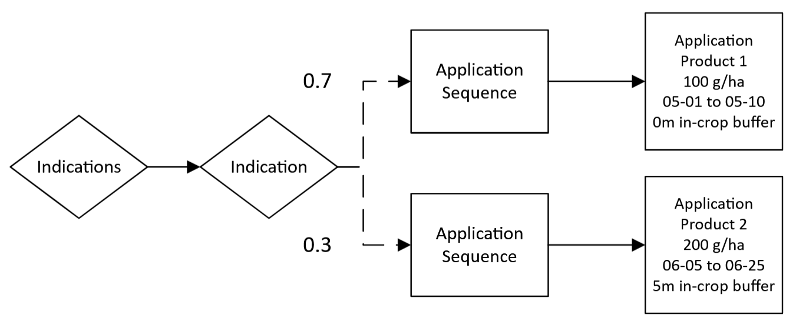

# Multiple application sequences

To be able to model real-world phenomena like market share, `ApplicationSequence` XML elements have a probability value associated with them.

!!! note
    For each `Indication`, the sum of all `ApplicationSequence` probability values must sum to exactly 1.0. 

An `ApplicationSequence` has a probability of occurring for each field according to the user-defined probability value. The `ApplicationSequence` probability is sampled each year of the simulation, meaning that the `ApplicationSequence` chosen for a given year is not necessarily the `ApplicationSequence` that will be chosen next year for that field.

``` xml
<?xml version="1.0" encoding="UTF-8"?>
<PPMCalendar xmlns="urn:xCropProtectionLandscapeScenarioParametrization">
    <TemporalValidity scales="time/simulation"> always </TemporalValidity>
    <TargetCrops type="list[int]" scales="global"> 10 </TargetCrops>
    <Indications>
        <Indication type="xCropProtection.ChoiceDistribution" scales="time/year, space/base_geometry">
            <ApplicationSequence probability="0.7">
                <Application>
                    <Tank>
                        <Products type="list[str]" scales="other/products">
                            Product 1
                        </Products>
                        <ApplicationRates scales="other/products">
                            <ApplicationRate type="float" unit="g/ha" scales="global">
                                100
                            </ApplicationRate>
                        </ApplicationRates>
                    </Tank>
                    <ApplicationWindow type="xCropProtection.MonthDaySpan" scales="global">
                        05-01 to 05-10
                    </ApplicationWindow>
                    <Technology scales="global">Technology</Technology>
                    <InCropBuffer type="float" unit="m" scales="global">0</InCropBuffer>
                    <InFieldMargin type="float" unit="m" scales="global">0</InFieldMargin>
                    <MinimumAppliedArea type="float" unit="m²" scales="global">0</MinimumAppliedArea>
                </Application>
            </ApplicationSequence>
            <ApplicationSequence probability="0.3">
                <Application>
                    <Tank>
                        <Products type="list[str]" scales="other/products">
                            Product 2
                        </Products>
                        <ApplicationRates scales="other/products">
                            <ApplicationRate type="float" unit="g/ha" scales="global">
                                200
                            </ApplicationRate>
                        </ApplicationRates>
                    </Tank>
                    <ApplicationWindow type="xCropProtection.MonthDaySpan" scales="global">
                        06-05 to 06-25
                    </ApplicationWindow>
                    <Technology scales="global">Technology</Technology>
                    <InCropBuffer type="float" unit="m" scales="global">5</InCropBuffer>
                    <InFieldMargin type="float" unit="m" scales="global">0</InFieldMargin>
                    <MinimumAppliedArea type="float" unit="m²" scales="global">0</MinimumAppliedArea>
                </Application>
            </ApplicationSequence>
        </Indication>
    </Indications>
</PPMCalendar>
```

## Scenario explanation

In this example, the first `ApplicationSequence` will be selected for 70% of applications each year, while the second `ApplicationSequence` will be selected for the remaining 30% of applications each year.

``` xml
<ApplicationSequence probability="0.7">
...
<ApplicationSequence probability="0.3">
```

For explanations of each element, see [simple scenario](simple-scenario.md).

## Flow chart

