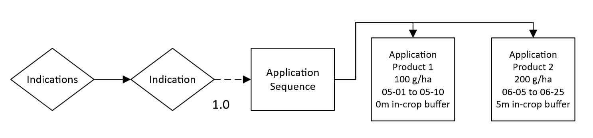

# Multiple applications

An `ApplicationSequence` can contain multiple `Application` elements, each with independent attributes.

Adding multiple `Application` elements to an `ApplicationSequence` should be used when applications are dependent on each other, though the attributes of each `Application` need not be the same.

``` xml
<?xml version="1.0" encoding="UTF-8"?>
<PPMCalendar xmlns="urn:xCropProtectionLandscapeScenarioParametrization">
    <TemporalValidity scales="time/simulation"> always </TemporalValidity>
    <TargetCrops type="list[int]" scales="global"> 10 </TargetCrops>
    <Indications>
        <Indication type="xCropProtection.ChoiceDistribution" scales="time/year, space/base_geometry">
            <ApplicationSequence probability="1">
                <Application>
                    <Tank>
                        <Products type="list[str]" scales="other/products">
                            Product 1
                        </Products>
                        <ApplicationRates scales="other/products">
                            <ApplicationRate type="float" unit="g/ha" scales="global">
                                100
                            </ApplicationRate>
                        </ApplicationRates>
                    </Tank>
                    <ApplicationWindow type="xCropProtection.MonthDaySpan" scales="global">
                        05-01 to 05-10
                    </ApplicationWindow>
                    <Technology scales="global">
                        Technology
                    </Technology>
                    <InCropBuffer type="float" unit="m" scales="global">
                        0
                    </InCropBuffer>
                    <InFieldMargin type="float" unit="m" scales="global">
                        0
                    </InFieldMargin>
                    <MinimumAppliedArea type="float" unit="m²" scales="global">
                        0
                    </MinimumAppliedArea>
                </Application>
                <Application>
                    <Tank>
                        <Products type="list[str]" scales="other/products">
                            Product 2
                        </Products>
                        <ApplicationRates scales="other/products">
                            <ApplicationRate type="float" unit="g/ha" scales="global">
                                200
                            </ApplicationRate>
                        </ApplicationRates>
                    </Tank>
                    <ApplicationWindow type="xCropProtection.MonthDaySpan" scales="global">
                        06-05 to 06-25
                    </ApplicationWindow>
                    <Technology scales="global">
                        Technology
                    </Technology>
                    <InCropBuffer type="float" unit="m" scales="global">
                        5
                    </InCropBuffer>
                    <InFieldMargin type="float" unit="m" scales="global">
                        0
                    </InFieldMargin>
                    <MinimumAppliedArea type="float" unit="m²" scales="global">
                        0
                    </MinimumAppliedArea>
                </Application>
            </ApplicationSequence>
        </Indication>
    </Indications>
</PPMCalendar>
```

## Scenario explanation

In this example, two applications will occur each year for fields with LULC type 10:

``` xml
<TargetCrops type="list[int]" scales="global"> 10 </TargetCrops>
```

One application of Product 1 will occur between May 1st and May 10th with an application rate of 100 g/ha:

``` xml
<Tank>
    <Products type="list[str]" scales="other/products">
        Product 1
    </Products>
    <ApplicationRates scales="other/products">
        <ApplicationRate type="float" unit="g/ha" scales="global">
            100
        </ApplicationRate>
    </ApplicationRates>
</Tank>
<ApplicationWindow type="xCropProtection.MonthDaySpan" scales="global">
    05-01 to 05-10
</ApplicationWindow>
```

The same field will also receive an application of Product 2 between June 5th and June 25th with an application rate of 200 g/ha and an in-crop buffer of 5 meters:

``` xml
<Tank>
    <Products type="list[str]" scales="other/products">
        Product 2
    </Products>
    <ApplicationRates scales="other/products">
        <ApplicationRate type="float" unit="g/ha" scales="global">
            200
        </ApplicationRate>
    </ApplicationRates>
</Tank>
<ApplicationWindow type="xCropProtection.MonthDaySpan" scales="global">
    06-05 to 06-25
</ApplicationWindow>
...
<InCropBuffer type="float" unit="m" scales="global">
    5
</InCropBuffer>
```

For explanations of each element, see [simple scenario](simple-scenario.md).

## Flow chart

