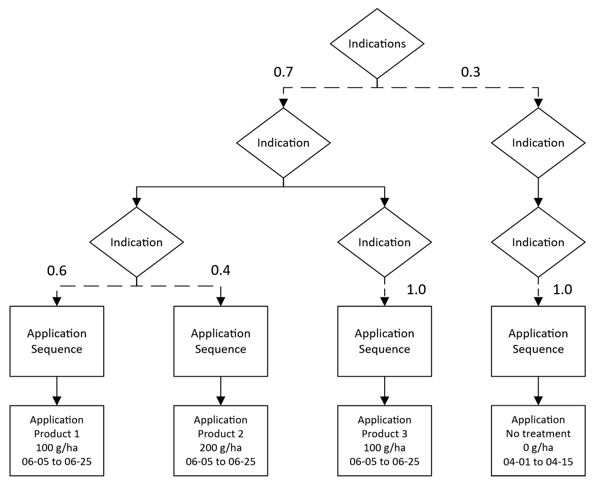

# Choice Between Multiple Indications

## Background
Pest control can be a rather complex undertaking. Modern integrated pest control tries to optimise control efficacy, at moderate economic cost and by minimising adverse environmental side effects. In such context, xCP offers the capability to evaluate alternative *Indications* in a *Crop Protection Calender*, ie, alternative measures against a certain pest in a crop, eg, alternative control of powdery mildew in vines, brown rot in apple, whitefly in olives, or blackgras in wheat. The choice of *Indications* might  represent *conventional* versus *organic* or *biological* pest control schemes. See also [Indications](../reference/glossary.md#indication) in the [Glossary](../reference/glossary.md).  

## Parameterisation
An example of one `ApplicationSequence` selected from **each** `Indication` was shown in [Multiple Indications](multiple-indications.md). However, the `Indications` element can also be used to select only 1 `Indication` based on probability values. The following example demonstrates a situation where some fields (of a certain crop type) will receive product applications with further choices and some fields will receive no applications.

``` xml
<?xml version="1.0" encoding="UTF-8"?>
<PPMCalendar xmlns="urn:xCropProtectionLandscapeScenarioParametrization">
    <TemporalValidity scales="time/simulation"> always </TemporalValidity>
    <TargetCrops type="list[int]" scales="global"> 10 </TargetCrops>
    <Indications type="xCropProtection.ChoiceDistribution" scales="time/year, space/base_geometry">
        <Indication probability="0.7">
            <Indication type="xCropProtection.ChoiceDistribution" scales="time/year, space/base_geometry">
                <ApplicationSequence probability="0.6">
                    <Application>
                        <Tank>
                            <Products type="list[str]" scales="other/products">
                                Product 1
                            </Products>
                            <ApplicationRates scales="other/products">
                                <ApplicationRate type="float" unit="g/ha" scales="global">
                                    100
                                </ApplicationRate>
                            </ApplicationRates>
                        </Tank>
                        <ApplicationWindow type="xCropProtection.MonthDaySpan" scales="global">
                            06-05 to 06-25
                        </ApplicationWindow>
                        <Technology scales="global">Technology</Technology>
                        <InCropBuffer type="float" unit="m" scales="global">0</InCropBuffer>
                        <InFieldMargin type="float" unit="m" scales="global">0</InFieldMargin>
                        <MinimumAppliedArea type="float" unit="m²" scales="global">0</MinimumAppliedArea>
                    </Application>
                </ApplicationSequence>
                <ApplicationSequence probability="0.4">
                    <Application>
                        <Tank>
                            <Products type="list[str]" scales="other/products">
                                Product 2
                            </Products>
                            <ApplicationRates scales="other/products">
                                <ApplicationRate type="float" unit="g/ha" scales="global">
                                    200
                                </ApplicationRate>
                            </ApplicationRates>
                        </Tank>
                        <ApplicationWindow type="xCropProtection.MonthDaySpan" scales="global">
                            06-05 to 06-25
                        </ApplicationWindow>
                        <Technology scales="global">Technology</Technology>
                        <InCropBuffer type="float" unit="m" scales="global">0</InCropBuffer>
                        <InFieldMargin type="float" unit="m" scales="global">0</InFieldMargin>
                        <MinimumAppliedArea type="float" unit="m²" scales="global">0</MinimumAppliedArea>
                    </Application>
                </ApplicationSequence>
            </Indication>
            <Indication type="xCropProtection.ChoiceDistribution" scales="time/year, space/base_geometry">
                <ApplicationSequence probability="1.0">
                    <Application>
                        <Tank>
                            <Products type="list[str]" scales="other/products">
                                Product 3
                            </Products>
                            <ApplicationRates scales="other/products">
                                <ApplicationRate type="float" unit="g/ha" scales="global">
                                    100
                                </ApplicationRate>
                            </ApplicationRates>
                        </Tank>
                        <ApplicationWindow type="xCropProtection.MonthDaySpan" scales="global">
                            06-05 to 06-25
                        </ApplicationWindow>
                        <Technology scales="global">Technology</Technology>
                        <InCropBuffer type="float" unit="m" scales="global">0</InCropBuffer>
                        <InFieldMargin type="float" unit="m" scales="global">0</InFieldMargin>
                        <MinimumAppliedArea type="float" unit="m²" scales="global">0</MinimumAppliedArea>
                    </Application>
                </ApplicationSequence>
            </Indication>
        </Indication>
        <Indication probability="0.3" >
            <Indication type="xCropProtection.ChoiceDistribution" scales="time/year, space/base_geometry">
                <ApplicationSequence probability="1.0">
                    <Application>
                        <Tank>
                            <Products type="list[str]" scales="other/products">
                                No treatment
                            </Products>
                            <ApplicationRates scales="other/products">
                                <ApplicationRate type="float" unit="g/ha" scales="global">
                                    0
                                </ApplicationRate>
                            </ApplicationRates>
                        </Tank>
                        <ApplicationWindow type="xCropProtection.MonthDaySpan" scales="global">
                            04-01 to 04-15
                        </ApplicationWindow>
                        <Technology scales="global">Technology</Technology>
                        <InCropBuffer type="float" unit="m" scales="global">0</InCropBuffer>
                        <InFieldMargin type="float" unit="m" scales="global">0</InFieldMargin>
                        <MinimumAppliedArea type="float" unit="m²" scales="global">0</MinimumAppliedArea>
                    </Application>
                </ApplicationSequence>
            </Indication>
        </Indication>
    </Indications>
</PPMCalendar>
```

### Explanation

In this example, all fields have a 30% chance of receiving "no treatment" and a 70% chance of receiving a series of applications sampled from the first `Indication`. If a field does receive an application, it will receive an application of either Product 1 **OR** Product 2, followed by an application of Product 3.

``` xml
<Indications type="xCropProtection.ChoiceDistribution" scales="time/year, space/base_geometry">
<Indication probability="0.7">
    <Indication type="xCropProtection.ChoiceDistribution" scales="time/year, space/base_geometry">
        <ApplicationSequence probability="0.6">
            <Application>
                <Products type="list[str]" scales="other/products">
                    Product 1
                </Products>
                ...
            </Application>
        </ApplicationSequence>
        <ApplicationSequence probability="0.4">
            <Application>
                <Products type="list[str]" scales="other/products">
                    Product 2
                </Products>
                ...
            </Application>
        </ApplicationSequence>
    </Indication>
    <Indication type="xCropProtection.ChoiceDistribution" scales="time/year, space/base_geometry">
        <ApplicationSequence probability="1.0">
            <Application>
                <Products type="list[str]" scales="other/products">
                    Product 3
                </Products>
                ...
        </ApplicationSequence>
    </Indication>
</Indication>
<Indication probability="0.3" >
    <Indication type="xCropProtection.ChoiceDistribution" scales="time/year, space/base_geometry">
        <ApplicationSequence probability="1.0">
            <Application>
                <Products type="list[str]" scales="other/products">
                    No treatment
                </Products>
                ...
            </Application>
        </ApplicationSequence>
    </Indication>
</Indication>
</Indications>
```

In this situation, an `ApplicationSequence` may still contain more than one `Application`. If that `ApplicationSequence` is selected, all `Application` elements contained in the selected `ApplicationSequence` will still be applied to the field. For explanations of each element, see [Simple Scenario](simple-scenario.md).


### Illustration

  

See also ['Indications'](../reference/glossary.md#indication) for the full picture of xCP entities and their relationship.
