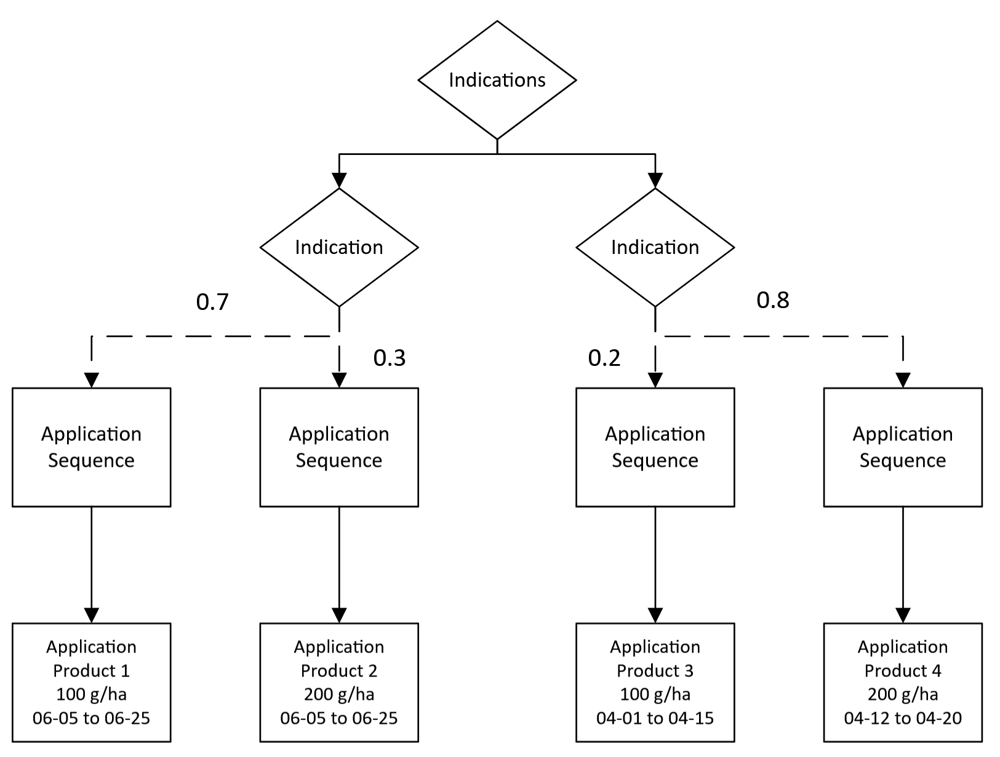

# Multiple indications

Indications hold one or more `ApplicationSequence` elements which each have a probability associated with them. A PPMCalendar can have 1 or more `Indication` elements in its list of `Indications`. When xCropProtection runs, one `ApplicationSequence` from each `Indication` will be chosen.

``` xml
<?xml version="1.0" encoding="UTF-8"?>
<PPMCalendar xmlns="urn:xCropProtectionLandscapeScenarioParametrization">
    <TemporalValidity scales="time/simulation"> always </TemporalValidity>
    <TargetCrops type="list[int]" scales="global"> 10 </TargetCrops>
    <Indications>
        <Indication type="xCropProtection.ChoiceDistribution" scales="time/year, space/base_geometry">
            <ApplicationSequence probability="0.7">
                <Application>
                    <Tank>
                        <Products type="list[str]" scales="other/products">
                            Product 1
                        </Products>
                        <ApplicationRates scales="other/products">
                            <ApplicationRate type="float" unit="g/ha" scales="global">
                                100
                            </ApplicationRate>
                        </ApplicationRates>
                    </Tank>
                    <ApplicationWindow type="xCropProtection.MonthDaySpan" scales="global">
                        06-05 to 06-25
                    </ApplicationWindow>
                    <Technology scales="global">Technology</Technology>
                    <InCropBuffer type="float" unit="m" scales="global">0</InCropBuffer>
                    <InFieldMargin type="float" unit="m" scales="global">0</InFieldMargin>
                    <MinimumAppliedArea type="float" unit="m²" scales="global">0</MinimumAppliedArea>
                </Application>
            </ApplicationSequence>
            <ApplicationSequence probability="0.3">
                <Application>
                    <Tank>
                        <Products type="list[str]" scales="other/products">
                            Product 2
                        </Products>
                        <ApplicationRates scales="other/products">
                            <ApplicationRate type="float" unit="g/ha" scales="global">
                                200
                            </ApplicationRate>
                        </ApplicationRates>
                    </Tank>
                    <ApplicationWindow type="xCropProtection.MonthDaySpan" scales="global">
                        06-05 to 06-25
                    </ApplicationWindow>
                    <Technology scales="global">Technology</Technology>
                    <InCropBuffer type="float" unit="m" scales="global">0</InCropBuffer>
                    <InFieldMargin type="float" unit="m" scales="global">0</InFieldMargin>
                    <MinimumAppliedArea type="float" unit="m²" scales="global">0</MinimumAppliedArea>
                </Application>
            </ApplicationSequence>
        </Indication>
        <Indication type="xCropProtection.ChoiceDistribution" scales="time/year, space/base_geometry">
            <ApplicationSequence probability="0.2">
                <Application>
                    <Tank>
                        <Products type="list[str]" scales="other/products">
                            Product 3
                        </Products>
                        <ApplicationRates scales="other/products">
                            <ApplicationRate type="float" unit="g/ha" scales="global">
                                100
                            </ApplicationRate>
                        </ApplicationRates>
                    </Tank>
                    <ApplicationWindow type="xCropProtection.MonthDaySpan" scales="global">
                        04-01 to 04-15
                    </ApplicationWindow>
                    <Technology scales="global">Technology</Technology>
                    <InCropBuffer type="float" unit="m" scales="global">0</InCropBuffer>
                    <InFieldMargin type="float" unit="m" scales="global">0</InFieldMargin>
                    <MinimumAppliedArea type="float" unit="m²" scales="global">0</MinimumAppliedArea>
                </Application>
            </ApplicationSequence>
            <ApplicationSequence probability="0.8">
                <Application>
                    <Tank>
                        <Products type="list[str]" scales="other/products">
                            Product 4
                        </Products>
                        <ApplicationRates scales="other/products">
                            <ApplicationRate type="float" unit="g/ha" scales="global">
                                200
                            </ApplicationRate>
                        </ApplicationRates>
                    </Tank>
                    <ApplicationWindow type="xCropProtection.MonthDaySpan" scales="global">
                        04-12 to 04-20
                    </ApplicationWindow>
                    <Technology scales="global">Technology</Technology>
                    <InCropBuffer type="float" unit="m" scales="global">0</InCropBuffer>
                    <InFieldMargin type="float" unit="m" scales="global">0</InFieldMargin>
                    <MinimumAppliedArea type="float" unit="m²" scales="global">0</MinimumAppliedArea>
                </Application>
            </ApplicationSequence>
        </Indication>
    </Indications>
</PPMCalendar>
```

## Scenario explanation

In this example, a field with LULC type 10 will receive 1 application of either Product 1 or Product 2, **AND** 1 application of either Product 3 or Product 4. Note that the dates of each of these applications are completely independent of each other.

``` xml
<Indications>
    <Indication type="xCropProtection.ChoiceDistribution" scales="time/year, space/base_geometry">
        <ApplicationSequence probability="0.7">
            <Application>
                <Tank>
                    <Products type="list[str]" scales="other/products">
                        Product 1
                    ...
                </Tank>
                ...
            </Application>
        </ApplicationSequence>
        <ApplicationSequence probability="0.3">
            <Application>
                <Tank>
                    <Products type="list[str]" scales="other/products">
                        Product 2
                    </Products>
                    ...
                </Tank>
                ...
            </Application>
        </ApplicationSequence>
    </Indication>
    <Indication type="xCropProtection.ChoiceDistribution" scales="time/year, space/base_geometry">
            <ApplicationSequence probability="0.2">
                <Application>
                    <Tank>
                        <Products type="list[str]" scales="other/products">
                            Product 3
                        </Products>
                        ...
                    </Tank>
                    ...
                </Application>
            </ApplicationSequence>
            <ApplicationSequence probability="0.8">
                <Application>
                    <Tank>
                        <Products type="list[str]" scales="other/products">
                            Product 4
                        </Products>
                        ...
                    </Tank>
                    ...
                </Application>
            </ApplicationSequence>
        </Indication>
</Indications>
```

`Indication` elements can be used when a product needs to be selected from a group of products, such as to choose from separate options for herbicide and fungicide applications. In other words, multiple `Indication` elements should be used when multiple `Products` need to be applied to a field that are highly independent of each other.

For explanations of each element, see [simple scenario](simple-scenario.md).

## Flow chart

