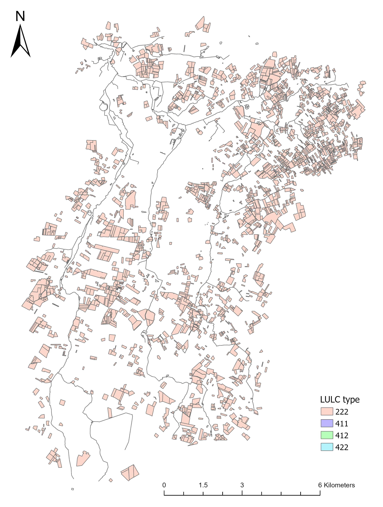
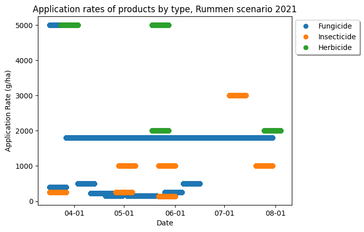

## Overview

This scenario represents a catchment near Rummen, Belgium. It represents real-world use patterns of apple growers in Belgium using survey data from 2021.

[GitHub repository for scenario](https://github.com/xlandscape/Scenario-Rummen)

## Geo information




LULC type 222 is the target type for all applications. In total, there are 4,975 fields in the Rummen scenario.

Field information:

|LULC type  |Number of fields   |Area (ha)  |
|:----------|------------------:|----------:|
|222        |2,611              |3,085      |
|411        |3                  |0.6        |
|412        |100                |4          |
|422        |1,661              |28         |

## Application information

Application information obtained by surveying apple growers in 2021 was used to paramaterize xCropProtection. An application window of 5 days before and after the source application date was added (e.g., application date of May 16<sup>th</sup> -> application window of May 11<sup>th</sup> - May 21<sup>st</sup>).

This scenario is split into two sub-scenarios: scenario A and scenario B. In scenario A, all applications in the source table map directly to `Application` elements in the PPM Calendars. This means that applications with the same application date in the source table may not actually be applied on the same day. In scenario B, any applications defined with the same application date are added to a tank mix. In scenario B, any products applied on the same day in the source data are applied on the same day in xCropProtection.

Scenario A - (add link to download xml file if not confidential)

Scenario B - (add link to download xml file if not confidential)

The following is an example of the differences between scenario A and scenario B:

<div class="grid" markdown>
```xml title="Scenario A"
<Application>
    <Tank>
        <Products type="list[str]" scales="other/products">
            Product 1
        </Products>
        <ApplicationRates scales="other/products">
            <ApplicationRate type="float" unit="g/ha" scales="global">
                1000
            </ApplicationRate>
        </ApplicationRates>
    </Tank>
    <ApplicationWindow type="xCropProtection.MonthDaySpan">04-06 to 04-16</ApplicationWindow>
    <Technology scales="global">Technology</Technology>
    <InCropBuffer type="float" unit="m" scales="global">0</InCropBuffer>
    <InFieldMargin type="float" unit="m" scales="global">0</InFieldMargin>
    <MinimumAppliedArea type="float" unit="m²" scales="global">0</MinimumAppliedArea>
</Application>
<Application>
    <Tank>
        <Products type="list[str]" scales="other/products">
            Product 2
        </Products>
        <ApplicationRates scales="other/products">
            <ApplicationRate type="float" unit="g/ha" scales="global">
                300
            </ApplicationRate>
        </ApplicationRates>
    </Tank>
    <ApplicationWindow type="xCropProtection.MonthDaySpan">04-06 to 04-16</ApplicationWindow>
    <Technology scales="global">Technology</Technology>
    <InCropBuffer type="float" unit="m" scales="global">0</InCropBuffer>
    <InFieldMargin type="float" unit="m" scales="global">0</InFieldMargin>
    <MinimumAppliedArea type="float" unit="m²" scales="global">0</MinimumAppliedArea>
</Application>
```

```xml title="Scenario B"
<Application>
    <Tank>
        <Products type="list[str]" scales="other/products">
            Product 1|Product 2
        </Products>
        <ApplicationRates scales="other/products">
            <ApplicationRate type="float" unit="g/ha" scales="global">
                1000
            </ApplicationRate>
            <ApplicationRate type="float" unit="g/ha" scales="global">
                300
            </ApplicationRate>
        </ApplicationRates>
    </Tank>
    <ApplicationWindow type="xCropProtection.MonthDaySpan">04-06 to 04-16</ApplicationWindow>
    <Technology scales="global">Technology</Technology>
    <InCropBuffer type="float" unit="m" scales="global">0</InCropBuffer>
    <InFieldMargin type="float" unit="m" scales="global">0</InFieldMargin>
    <MinimumAppliedArea type="float" unit="m²" scales="global">0</MinimumAppliedArea>
</Application>
```
</div>

## Results



To add if information can be shared:

- Application rate by product (and active substance?)
- Cumulative loading by product (and active substance?)
- xToxicLoad results?