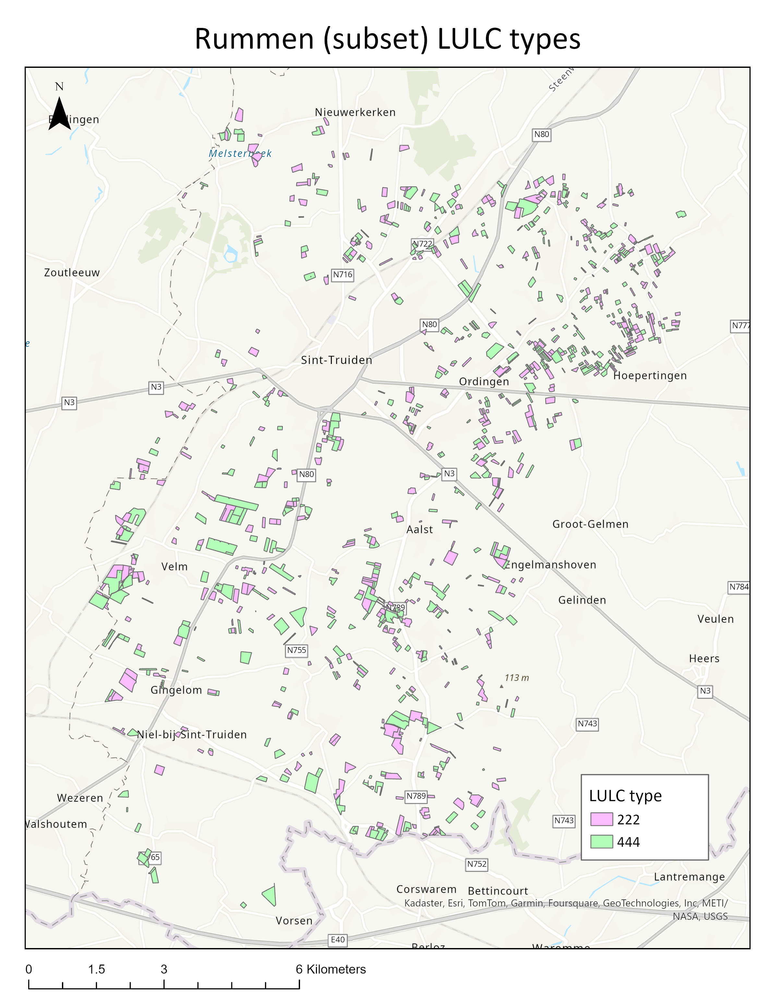

## Overview

This scenario is a subset of the [full Rummen scenario](rummen-scenario.md). Its main purpose is to test xCropProtection features and repository configuration.

## Geo information

This scenario consists of 1,000 fields, half having the LULC type 222 and half having the LULC type 444.

Field information:

|LULC type  |Number of fields   |Area (ha)  |
|:----------|------------------:|----------:|
|222        |500                |524        |
|444        |500                |620        |

## Application information

Location of PPM Calendars: *CropProtection\PPMCalendars\Rummen-xCP-TestingScenario*

This scenario may be used along with its PPM Calendars to gain familiarity with the structure and output of xCropProtection. The two PPM Calendars located in the *Rummen-xCP-TestingScenario* folder contain simple applications with sample products. This scenario may also be used in the development of new PPM Calendars because of the relatively small number of fields.