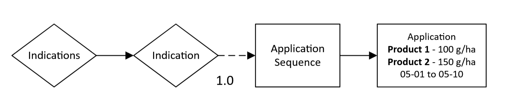

# Tank mixes

Multiple products can be defined in one tank to ensure that they will be applied on the same date and with the same values for `InCropBuffer`, `InFieldMargin`, and `MinimumAppliedArea`. Additionally, if the `ApplicationRates` are defined as probability distributions, the sampling of all `ApplicationRates` will occur with the same parameters.

The number of `Products` in a `Tank` and the number of `ApplicationRates` must be the same; however, no warnings will appear if the numbers are not equal. The first `ApplicationRate` applies to the first product in the `Tank`, the second `ApplicationRate` applies to the second product in the `Tank`, etc.

!!! note
    Multiple product names must be separated with a '|' character.


``` xml
<?xml version="1.0" encoding="UTF-8"?>
<PPMCalendar xmlns="urn:xCropProtectionLandscapeScenarioParametrization">
    <TemporalValidity scales="time/simulation"> always </TemporalValidity>
    <TargetCrops type="list[int]" scales="global"> 10 </TargetCrops>
    <Indications>
        <Indication type="xCropProtection.ChoiceDistribution" scales="time/year, space/base_geometry">
            <ApplicationSequence probability="1">
                <Application>
                    <Tank>
                        <Products type="list[str]" scales="other/products">
                            Product 1|Product 2
                        </Products>
                        <ApplicationRates scales="other/products">
                            <ApplicationRate type="float" unit="g/ha" scales="global">
                                100
                            </ApplicationRate>
                            <ApplicationRate type="float" unit="g/ha" scales="global">
                                150
                            </ApplicationRate>
                        </ApplicationRates>
                    </Tank>
                    <ApplicationWindow type="xCropProtection.MonthDaySpan" scales="global">
                        05-01 to 05-10
                    </ApplicationWindow>
                    <Technology scales="global">Technology</Technology>
                    <InCropBuffer type="float" unit="m" scales="global">0</InCropBuffer>
                    <InFieldMargin type="float" unit="m" scales="global">0</InFieldMargin>
                    <MinimumAppliedArea type="float" unit="m²" scales="global">0</MinimumAppliedArea>
                </Application>
            </ApplicationSequence>
        </Indication>
    </Indications>
</PPMCalendar>
```

## Scenario explanation

In this example, Product 1 and Product 2 have been added to one `Tank`. Each year of the simulation, they will both be applied on the same day between May 1st and May 10th (a random day will be selected each year with each day being equally likely). Product 1 will receive an application rate of 100 g/ha and Product 2 will receive an application rate of 150 g/ha. Values for `Technology`, `InCropBuffer`, `InFieldMargin`, and `MinimumAppliedArea` will apply to both product applications.

For explanations of each element, see [simple scenario](simple-scenario.md).

## Flow chart

