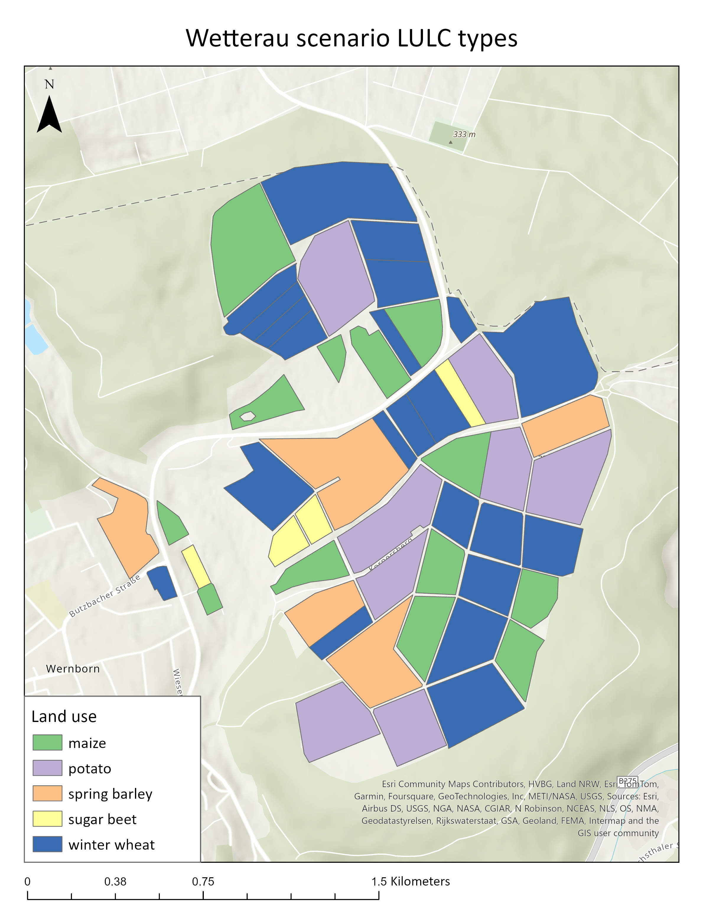
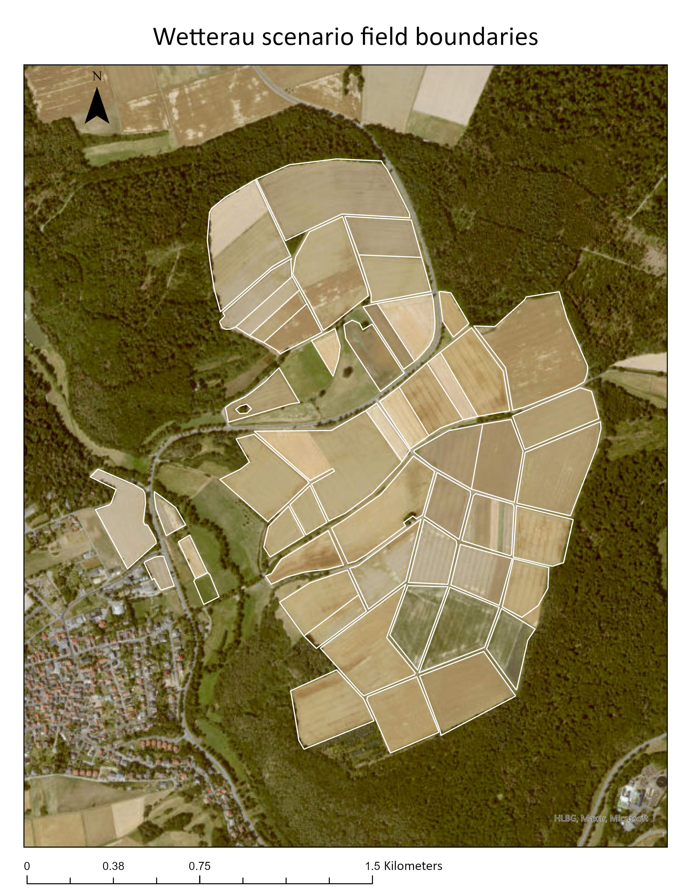

## Overview

This scenario is located in the Wetterau (Hessian, Germany). It is a subset of a larger scenario, and contains only 52 fields. Each field has been randomly assigned one of 5 land use types.

## Geo information

In total, there are 52 fields in the Wetterau scenario.

Field information:

|LULC type          |Number of fields   |Area (ha)  |
|:------------------|------------------:|----------:|
|6 (maize)          |13                 |50.9       |
|9 (potato)         |8                  |58.5       |
|12 (sugar beet)    |4                  |6.9        |
|16 (spring barley) |5                  |39.5       |
|17 (winter wheat)  |22                 |102.1      |

## Application information

Location of PPM Calendars: *CropProtection\PPMCalendars\Wetterau-scenario-subset*

The Wetterau scenario uses 5 PPM Calendars, one for each crop type. Each calendar is paramaterized with one application of a product named "Product_i1", with different application windows for each crop type.
