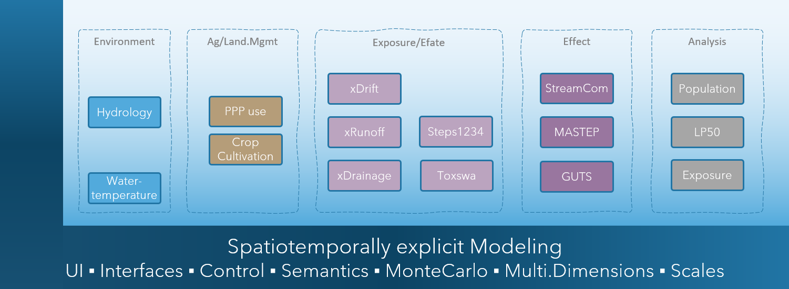

# xLandscape
**xLandscape is not a model**. It's **a modular framework** that allows **to build models**. The models to build are typically intended to simulate processes (phenomenons) in **real-world landscapes**.  
Therefore, the ***core*** of the xLandscape approach implements characteristics of **spatiotemporally eXplicit** modelling using geoinformation. Beyond space and time, further dimensions and scales are explicitelly represented. The prefix ***x*** shall indicate this. This design intends to simulate pattern of real-world landscape conditions using a *Monte Carlo* approach.  
Another fundamental principle is that xLandscape has a **modular design**. Modules are called ***components*** as the software architecture is based on *Component-Based Software Enginieering* (CBSE). The graphic below shows the **composition** of a catchment-scale model *xAquatic* (Github: [xAquatic](https://github.com/xlandscape/xAquaticRisk)).  
  
The **current major release level is *1.x***, which essentially means that we have a working software available that implements the key design and  essential requirements. The [Vision](#vision) below explains where we want to go to. xLandscape is **open source** (Github: [xLandscape](https://github.com/xlandscape), see the xLandscape [README](https://github.com/xlandscape/LandscapeModel-Core/blob/master/README.md) for technical details and instructions).  

  

*Illustration of a model composition using the xLandscape framework. The ***core*** is represented by the framing 'L' (dark blue). The boxes represent **components** (eg, 'xDrift') of specific functionality. The composition make a model, here xAquatic which simulates pesticide use in catchments, exposure of streams, pesticide transport and fate in streams, as well as effects to aquatic invertebrate species*. The integration assures inner consistancy of data and semantics (indicated by the light blue backgroud).  

For futher information you might contact Thorsten Schad (thorsten.schad@bayer.com) or Sascha Bub (sascha.bub@rptu.de).  

## Our Vision
### *in what situation did we start?!*
In the 2000s, pesticide risk assessment was based on a combination of conservative (worst-case) exposure scenario assumptions and ecotoxicological testing conditions. Although this risk assessment design assures a high level of protectiveness (when passing the risk assessment) it does not allow to define effective and efficient risk management measures, nor does it provide answers in cases where unacceptable risk was indicated for worst-case conditions.  
With the central goal of a better understanding of real-world pesticide risk, in a phase of improved availability of environmental (geo)data together with process models (eg, FOCUS xxx), 
In recent years, data has improved xxx remote sensing, xxx,   
effect models  

 

beyond the initial motivation described above, today much extended requirements and views to the use of pesticides has emerged 
Green Deal, pesticide use reductions  , integrated pest management, minimise the use of chemicals  
 more general approach was i
holitstic view to pesticide risk  
big picture  
develop integrated 

today called *Digital Twins*  

### *where we want to go to!*
a system that allows to build models that can operate on landscape-scales,  

Imagine, 
- modular system available which you can make use of and add your modules
- Integrated Development Environment
- make use of existing models and data, extend them by your model and so focus on your developments 
- models can be data-driven or mechanistic  

**build for exchange with the regulatory scientific community**  

## History
The development of xLandscape was initiated due to shortcomings or even missing approaches 

With its advent Available approaches on landscape modelling (Schad 2013). some developments were effectively stopped with the end of the research initiative, some were treated highly protective (Inra), 
Early 
early work on landscape-level risk assessment had a focus on making exposure modelling more realistic.  our key critics on approaches at that time (mid 2000s) was about the sampling methods xxx generated non-realistic conditions, hence, distributions of exposure and so risk assessment.  pattern, units, scales where missing  
tested working within GIS, close to big-data spatial databases (eg rasdaman), Almass, OpenMI, xxx and a range of related approaches which all ended up in dead ends for the purposes and needs of our work in environmental risk assessment, risk management and more generic related fields. 

early module: xDrift (ref)  
modular approach  
today, we have  

## xLandscape Version 1.x 
Characteristics

- 
- numeric, Monte Carlo
- multidimensional, 
- Python

### Modules and Components 

You will read the term ***component*** quite often in the context of *xLandscape* and so *xCP*.  = Mo-Based Software
[*components*](#modules-and-components) 
lego bricks

### Multidimensional Data Store

currently, [HDF](xLandscape/xLandscape-intro.md#multidimensional-data-store) is being used.  

### Model Input (Geo)Data

### Analysis

Jupyter notebooks

