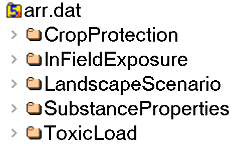
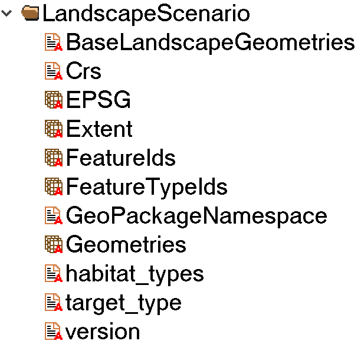
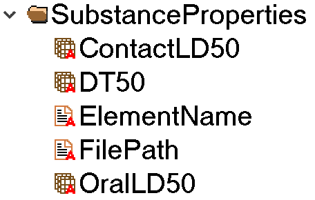
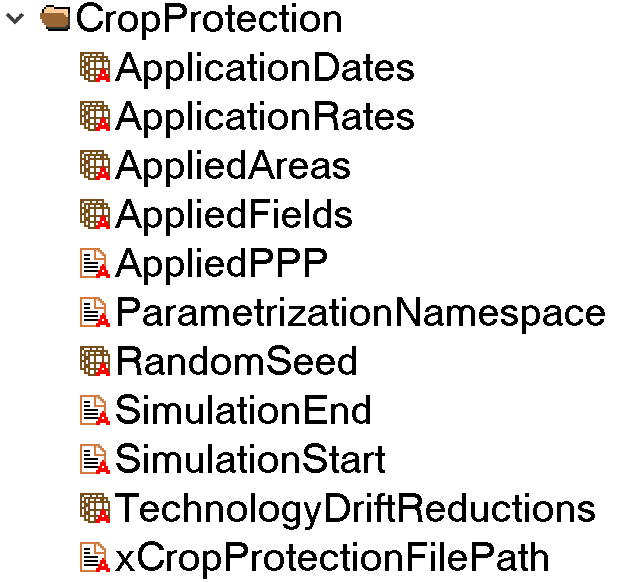
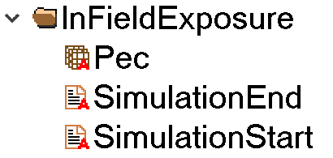
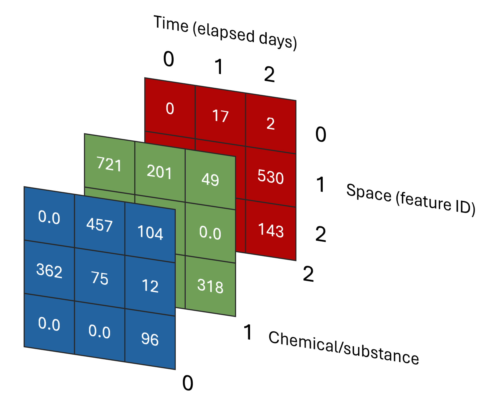

# xToxicLoad output

# xToxicLoad output

This page will describe the structure and content of xToxicLoad's output. xToxicLoad provides the results of a run in an [hdf5](https://docs.hdfgroup.org/hdf5/v1_14/_intro_h_d_f5.html) (Hierarchical Data Format version 5) file format. This file type can be viewed with a program such as [HDFView](https://www.hdfgroup.org/downloads/hdfview/).

## General structure

{width="30%"}

The output of xToxicLoad follows the dataset structure as seen in the image above; each of these 6 directories are the result of a module that is run during xToxicLoad. They are discussed here in the order in which they are run.

## LandscapeScenario

{width="30%"}

This directory contains information about the landscape used in the scenario. The FeatureIds, FeatureTypeIds, and Geometries datasets can be used to link a field with its LULC type and geometry. An example using sample information is shown below:

|Index  |FeatureIds |FeatureTypeIds |Geometries         |
|-------|-----------|---------------|-------------------|
|0      |1206033332 |222            |[0,0,0,0,3,...]    |
|1      |928259482  |222            |[0,0,0,0,3,...]    |
|2      |748887688  |222            |[0,0,0,0,3,...]    |
|3      |431716987  |222            |[0,0,0,0,3,...]    |
|4      |925529136  |222            |[0,0,0,0,3,...]    |

## SubstanceProperties

{width="30%"}

The substance properties directory holds information parsed from the substance and product properties Excel file. Each column defined in the properties sheet will generate a dataset in this directory. In this screenshot, ContactLD50, OralLD50, and DT50 were all columns added to the properties sheet. The units defined for each column are also included in these datasets.

The sub-datasets in this dataset will differ depending on the columns defined in the substance and product properties Excel file located in the *chemical* folder.

## CropProtection

{width="30%"}

This directory contains the output of xCropProtection using the parameterization from *template.xrun*.

- ApplicationDates: The day that each application occurs, represented in days since 01/01/0001.
- ApplicationRates: The application rate of each application.
- AppliedAreas: The actual area applied, taking into account in-crop buffers and in-field margins.
- AppliedFields: The field ids of each application.
- AppliedPPP: The product or substance applied for each application.
- ParametrizationNamespace: The namespace of the parameterization files (ex: urn:xCropProtectionLandscapeScenarioParametrization)
- RandomSeed: The random seed used in the simulation (defaults to 0).
- SimulationEnd: The end date of the simulation, in the format YYYY-MM-DD.
- SimulationStart: The start date of the simulation, in the format YYYY-MM-DD.
- TechnolgyDriftReductions: The drift reduction values of the technology for each application.
- xCropProtectionFilePath: The file path of the *xCropProtection.xml* which contains the PPM Calendar and Technology information.

## InFieldExposure

{width="30%"}

This directory includes PEC values for each of the chemicals defined in SubstanceProperties. The Pec dataset is formatted as a three-dimensional array. The image below shows the structure with placeholder values:

{width="60%"}

Each column index represents the number of elapsed days since the SimulationStart value. A slice of a single column represents PEC values for all fields and all substances on a single day.

Each row index represents a unique field. Note that the index is not the feature ID, but the index of a field can be used to retrieve its feature ID in the LandscapeScenario directory. A slice of a single row represents PEC values for the whole simulation and all substances for a single field.

Each page represents a different chemical. A slice of a single page represents PEC values for the whole simulation for all fields for a single chemical.

## ToxicLoad

This directory contains the calculations for toxic load. The results are structured in the same way as the PEC values:

{width="60%"}

Each cell represents the oral toxic load of a chemcial on one field on one day.
