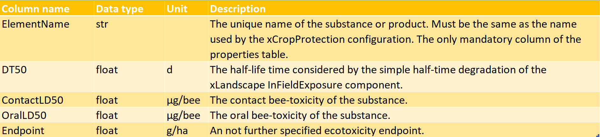

# xToxicLoad parameterization

This page describes all files needed to parameterize and run xToxicLoad. Additionally, a guide to creating new scenarios is provided.

[Scenario creation guide](#steps-to-create-a-new-scenario)

## template.xrun

In xToxicLoad, the user parameterization file is located in the root folder (*xToxicLoad*) with the .xrun file extension. This file can be written in XML or YAML.

### YAML

YAML is a human-friendly data serialization language that works well for configuration files. A sample YAML configuration file is shown below:

``` yaml title="template.xrun"
# $schema: ./model/variant/parameters.json
Project: scenario/Rummen-xToxicLoad-Test
SimID: xToxicLoad-Test
SimulationStart: 2020-01-01
SimulationEnd: 2022-12-31
CropProtectionScenario: test-xToxicLoad
SubstanceAndProductProperties: Substance and product properties - test1
NumberMC: 1
ParallelProcesses: 1
```

The schema for this file is located in the *xToxicLoad/model/variant* folder and describes the constraints for each key/value pair (in this file a key/value pair is two strings of text separated by a colon).

### XML

Here, the XML language is used to construct and transmit data to the xToxicLoad component. A sample XML configuration file is shown below (all comments removed):

``` xml title="template.xrun"
<?xml version="1.0" encoding="utf-8"?>
<Parameters>
  <Modeller>abc</Modeller>
  <Project>scenario/Rummen-xToxicLoad-Test</Project>
  <CropProtectionScenario>xCropProtection-Rummen</CropProtectionScenario>
  <ProductDatabase>CropProtection/product-database.db</ProductDatabase>
  <SimulationStart>2021-01-01</SimulationStart>
  <SimulationEnd>2021-12-31</SimulationEnd>
  <SimID>xToxicLoad-Test</SimID>
  <NumberMC>1</NumberMC>
  <ParallelProcesses>1</ParallelProcesses>
</Parameters>
```

*Template.xrun* files included in the xToxicLoad repository contain comments describing the constraints and purpose of each XML element.

## mc.xml

This file structures information for each Monte Carlo run of xToxicLoad, and most information in this file should not be modified. However, xToxicLoad currently defines two xCropProtection parameters in this file: `OutputApplicationType` and `ProductDatabase`.

`OutputApplicationType` sets the output type of xCropProtection to either product or active substance and `ProductDatabase` provides the file path to the SQLite database containing product formulation information.

Note the different combinations of input (specified in PPM Calendars) and `OutputApplicationType`.

``` { .yaml .no-copy }
input product 			-> output product 			: valid
input product 			-> output product			: valid
input active substance 	-> output active substance	: valid
input active substance 	-> output product 			: invalid
```

This file also defines which columns in the substance and product properties table will be used in the xToxicLoad component.

``` xml
<ToxicLoad module="components" class="ToxicLoad">
    <Pec>
        <FromOutput component="InFieldExposure" output="Pec"/>
    </Pec>
    <LD50>
        <FromOutput component="SubstanceProperties" output="Endpoint"/>
    </LD50>
</ToxicLoad>
```

The name of the column defined in the output attribute of `FromOutput` will be used to calculate the LD50. Only one column name (in one `FromOutput` element) should be defined in the LD50 element.

## Substance and product properties.xlsx

The substance and product properties file contains phisio-chemial and ecotoxicity properties for substances.

The description sheet holds metadata and organizational information about the file including the name, version, schema version, date last modified, author name, scale, and file description. The version and date attributes should be updated whenever there are changes to the substance and product properties file.

The columns sheet defines the name, data type, unit, and description for each column in the properties sheet. Removing, adding, or modifying rows in this sheet will change column requirements and attributes in the properties sheet. The Data type and Unit columns must be populated for any new rows added.

{width="60%"}

The properties sheet contains the ecotoxicity properties for each substance. The columns defined in the columns sheet must be present in this sheet, and they must also conform to the data type defined. Cells can be left blank (excluding the Element name); xToxicLoad will handle blank cells by producing `Null` values for those substances. `Null` values can then be filtered out in post-processing of the output file.

## xCropProtection.xml

xCropProtection parameterization is an important part of xToxicLoad, because xToxicLoad directly uses the results of xCropProtection. Detailed xCropProtection parameterization instructions can be found in the [scenarios](../create-scenario.md) section of this documentation.

## Landscape scenario

To run xToxicLoad, a scenario must be created in the *xToxicLoad/scenario* folder. There are 2 elements required for an xToxicLoad scenario: a geo folder and a *scenario.xproject* file.

The *scenario/geo* folder must contain a shapefile that will be used as input to the Landscape scenario component. The folder should contain at least the shapefile's main file (LULC.shp), index file (LULC.shx), and dBASE table (LULC.dbf). Other files such as CPG and PRJ files may be included to assist others when opening the shapefile in a GIS software.

The *scenario/geo* folder must also contain a *package.xinfo* file which defines the name of the shapefile and which columns should be used as input to the Landscape scenario component.

The *scenario.xproject* file contains metadata about the scenario and tracks changes across versions. If changes are made to the files in the *scenario/geo* folder, this file should be updated with a new version and changelog.

## Steps to create a new scenario

The following steps will provide a walkthrough on how to create a completely new scenario. Any text in all capital letters, e.g., SCENARIO_NAME, LULC.shp, is used as placeholder text and should be changed to more specific values when creating a scenario.

1. In the *xToxicLoad/scenario* folder, create a new folder named *SCENARIO_NAME*. This folder will hold spatial data for the new scenario. In the newly created folder, do the following:
    1. Create a *scenario.xproject* file and add the following text, replacing placeholder text where noted:
    ```xml title="scenario.xproject"
    <?xml version="1.0" encoding="utf-8"?>
    <Project
        xmlns="urn:xLandscapeModelScenarioInfo"
        xmlns:xsi="http://www.w3.org/2001/XMLSchema-instance"
        xsi:schemaLocation="urn:xLandscapeModelScenarioInfo ../../model/core/base/scenario.xsd">
        <Name>SCENARIO_NAME</Name>
        <Version>1.0</Version>
        <SupportedRuntimeVersions>
            <Version variant="xToxicLoad" number="0.1"/>
        </SupportedRuntimeVersions>
        <Description>SCENARIO DESCRIPTION.</Description>
        <TemporalExtent>
            <FromDate>yyyy-mm-dd</FromDate>
            <ToDate>yyyy-mm-dd</ToDate>
        </TemporalExtent>
        <Changelog>
            <Version number="1.0" date="yyyy-mm-dd">
                <Addition author="NAME">Scenario created.</Addition>
            </Version>
        </Changelog>
        <Content>
            <Item name="LandscapeScenario" target="geo/package.xinfo" version="1.0" />
        </Content>
        <Contacts>
            <Contact>NAME - EMAIL</Contact>
        </Contacts>
    </Project>
    ```
    Use an XML editor to help ensure proper formatting of elements, and make sure that the `xsi:schemaLocation` points to the xLandscapeModelScenarioInfo schema located in the *model/core/base* folder.
    2. Create a folder in the *xToxicLoad/scenario/SCENARIO_NAME* folder named *geo*. In the *geo* folder, add Shapefiles which will be used as input to the components. At a minimum, the Shapefile's main file (LULC.shp), index file (LULC.shx), and dBASE table (LULC.dbf) must be included.
    3. In the *xToxicLoad/scenario/SCENARIO_NAME/geo* folder, create a *package.xinfo* file. Use the following text to start and modify elements where necessary:
    ```xml title="package.xinfo"
    <?xml version="1.0" encoding="utf-8"?>
    <landscape_package 
        xmlns="urn:LandscapeScenarioGeoPackage"
        xmlns:xsi="http://www.w3.org/2001/XMLSchema-instance" 
        xsi:schemaLocation="urn:LandscapeScenarioGeoPackage ../../../model/variant/package.xsd">
        <meta>
            <version>1.0</version>
            <target_type>100</target_type>
            <habitat_types>200</habitat_types>
        </meta>
        <base>
            <base_landscape_geometries>LULC.shp</base_landscape_geometries>
            <feature_id_attribute>ALVID</feature_id_attribute>
            <feature_type_attribute>LULC_TYPE_ID</feature_type_attribute>
            <additional_attributes/>
        </base>
        <supplementary/>
        <supplementary_shapefiles/>
    </landscape_package>
    ```
    The `base_landscape_geometries` element defines the Shapefile name (including the .shp extension). The `feature_id_attribute` element defines the name of the field that defines each feature's ID. The `feature_type_attribute` element defines the field of the Shapefile which specifies a field/feature's LULC type. The TargetCrops value in *PPMCalendar.xml* refers to the field defined in `feature_type_attribute`.
    4. The *SCENARIO_NAME* folder setup is complete; the following is an example of the folder stucture.
    ``` { .yaml .no-copy }
    ├── scenario
    │   ├── SCENARIO_NAME
    │   │   ├── geo
    │   │   │   ├── LULC.shp
    │   │   │   ├── LULC.shx
    │   │   │   ├── LULC.dbf
    │   │   │   └── package.xinfo
    │   │   └── scenario.xproject
    ```
2. In the *xToxicLoad/crop_protection/PPMCalendars* folder, create a folder named *SCENARIO_NAME*. Add all xCropProtection PPM Calendars that the new scenario will use. For more information about creating xCropProtection PPM Calendars, see the [templates](../scenarios/templates-intro.md) pages.
3. In the *xToxicLoad/crop_protection* folder, create an XML file named *Technologies_SCENARIO.xml* using the following as an example of structure:
```xml title="Technologies_SCENARIO.xml"
<?xml version="1.0" encoding="UTF-8"?>
<Technologies xmlns="urn:xCropProtectionLandscapeScenarioParametrization">
  <Technology>
    <TechnologyName scales="global">Technology</TechnologyName>
    <DriftReduction type="float" unit="1" scales="global">0.5</DriftReduction>
  </Technology>
  <Technology>
    <TechnologyName scales="global">Technology2</TechnologyName>
    <DriftReduction type="float" unit="1" scales="global">0.4</DriftReduction>
  </Technology>
</Technologies>
```
This file holds information about the technologies used in the scenario.
4. In the *xToxicLoad/crop_protection* folder, create an XML file named *xCropProtection_SCENARIO.xml*. This file tells xCropProtection which PPM Calendars it should use in a simulation run. The following text may be used as a starting point:
```xml title="xCropProtection_SCENARIO.xml"
<?xml version="1.0" encoding="UTF-8"?>
<xCropProtection
    xmlns="urn:xCropProtectionLandscapeScenarioParametrization" 
    xmlns:xsi="http://www.w3.org/2001/XMLSchema-instance" 
    xsi:schemaLocation="urn:xCropProtectionLandscapeScenarioParametrization ../model/core/components/xCropProtection/xCropProtection.xsd">
    <PPMCalendars>
        <PPMCalendar include="PPMCalendars/SCENARIO/PPMCalendar-SCENARIO-LULC1.xml"/>
        <PPMCalendar include="PPMCalendars/SCENARIO/PPMCalendar-SCENARIO-LULC2.xml"/>
    </PPMCalendars>
    <Technologies include="Technologies_SCENARIO.xml"/>
</xCropProtection>
```
Note that the `include` attribute of `Technologies` may need to be modified to point to the new *Technologies_SCENARIO.xml* file. All file paths in this file are relative paths. The file structure of steps 2-5 should look like the following:
``` {.yaml .no-copy}
├── crop_protection
│   ├── PPMCalendars
│   │   ├── SCENARIO
│   │   │   ├── PPMCalendar-SCENARIO-LULC1.xml
│   │   │   └── PPMCalendar-SCENARIO-LULC2.xml
│   ├── Technologies_SCENARIO.xml
│   └── xCropProtection_SCENARIO.xml
```
5. In the *xToxicLoad/chemical* folder, create a substance and product properties Excel file named *SCENARIO_SUBSTANCE_PROPERTIES.xlsx* by duplicating a substance and product properties file that already exists in the *chemical* folder. See the [substance and product properties section](#substance-and-product-propertiesxlsx) for more detailed information on the contents of this file.
6. Also in the *xToxicLoad/chemical* folder, there is a pre-existing SQLite database. This database contains information on the relationship between some products and active substances. If the scale of the xCropProtection input is "product" and the output scale is "active substance", this database will be queried to determine the active substance(s) included in a given product and in what amounts. If this situation applies to the new scenario, confirm that all relationships are already present in the database or that they are added. For more information on the structure of this database, see **TODO**.
7. In the *xToxicLoad* folder, create a file named *template_SCENARIO.xrun* by duplicating and renaming an existing XRUN file. Parameterize this file using YAML or XML; information about the two formats is given in the [template.xrun](#templatexrun) section of this page.
``` yaml title="template_SCENARIO.xrun"
# $schema: ./model/variant/parameters.json
Project: scenario/SCENARIO_NAME
SimID: xToxicLoad-SCENARIO
SimulationStart: 2020-01-01
SimulationEnd: 2022-12-31
CropProtectionScenario: xCropProtection_SCENARIO
SubstanceAndProductProperties: SCENARIO_SUBSTANCE_PROPERTIES
NumberMC: 1
ParallelProcesses: 1
```
8. In *xToxicLoad/model/variant/mc.xml*, in the `CropProtection` element, confirm that the values of the `OutputApplicationType` and `ProductDatabase` elements are correct before using the *template_SCENARIO.xrun* file to run the scenario. The *mc.xml* file is not specific to any one scenario, so it should be modified before running a different scenario.

Overall, the following files should be created or modified:
```{.yaml .no-copy}
├── chemical
│   ├── SCENARIO_SUBSTANCE_PROPERTIES.xlsx
│   └── product-active-substance.db
├── crop_protection
│   ├── PPMCalendars
│   │   ├── SCENARIO
│   │   │   ├── PPMCalendar-SCENARIO-LULC1.xml
│   │   │   └── PPMCalendar-SCENARIO-LULC2.xml
│   ├── Technologies_SCENARIO.xml
│   └── xCropProtection_SCENARIO.xml
├── model
│   ├── variant
│   │   └── mc.xml
├── scenario
│   ├── SCENARIO_NAME
│   │   ├── geo
│   │   │   ├── LULC.shp
│   │   │   ├── LULC.shx
│   │   │   ├── LULC.dbf
│   │   │   └── package.xinfo
│   │   └── scenario.xproject
```